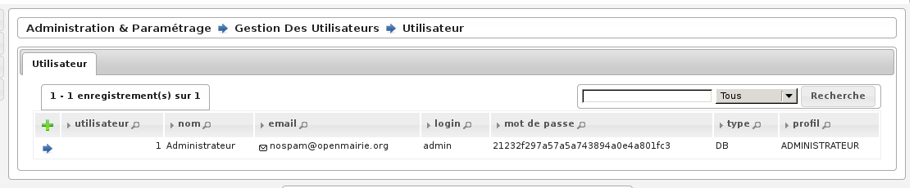

.. _administration:

##############
Administration
##############

.. figure:: a_menu-rubrik-administration.png

   Menu - Rubrique 'Administration'

.. _administration_parametres:

Paramètres
==========

Divers paramètres de l’application sont configurables ici : champs de fusion généraux disponibles pour les éditions pdf, activation/désactivation de modules complémentaires, paramétrages fonctionnels, ...

* **option_double_emargement** : Double colonnes sur l'émargement. Les valeurs possibles sont : *true* double colonne, *false* simple colonne. La valeur par défaut est *false*.

* **option_tri_liste_emargement** : La liste d'émargement peut être dressée par ordre des numéros d'inscription ou par ordre alphabétique des électeurs, au choix de la mairie. Les valeurs possibles sont : *alpha* tri par ordre alphabétique, *numero* tri par numéros d'inscription. La valeur par défaut est *alpha*.

* **option_refus_mouvement** : Possibilité de choisir si les courriers de refus de mouvement sont disponibles dans l'application. Les valeurs possibles sont : *false* refus de mouvement non disponibles, *true* refus de mouvement disponibles. La valeur par défaut est *true*.

* **option_code_voie_auto** : Possibilité de choisir si les codes voie sont automatiques ou non. Les valeurs possibles sont : *false* les codes voies ne sont pas automatiques, *true* les codes voie sont automatiques. La valeur par défaut est *true*.

* **option_code_barre** : Affichage des codes barres sur les cartes d'électeur. Les valeurs possibles sont : *true* affichage, *false* pas d'affichage. La valeur par défaut est *false*.

* **option_commission_sans_modification** : Les mouvements de modfication qui n'entraînent pas de changement de bureau n'apparaissent pas dans les listings pour la commission. Les valeurs possibles sont : *true* sans les modifications qui n'entrainent pas de changement de bureau, *false* avec les modifications qui n'entrainent pas de changement de bureau. La valeur par défaut est *true*.

* **parametrage_mouvement_venantautrecommune** : Code du type de mouvement obligeant la saisie d'une commune de provenance. La valeur par défaut est *CC*.

* **parametrage_mouvement_inscriptionoffice** : Code du type de mouvement pour les inscriptions d'office. La valeur par défaut est *IO*.

* **parametrage_etiquettes** : Paramétrage des planches d'étiquettes générées par openElec. Les valeurs par défaut sont : ::

    etiquette_bordure_etiquette=1
    etiquette_bordure_texte=0
    planche_marge_ext_haut=1
    planche_marge_ext_gauche=0
    planche_nb_colonnes=2
    planche_nb_lignes=7
    etiquette_largeur=105
    etiquette_hauteur=42
    etiquette_marge_int_haut=8
    etiquette_marge_int_gauche=8
    etiquette_marge_int_droite=8
    etiquette_espace_entre_colonnes=0
    etiquette_espace_entre_lignes=-1
    etiquette_hauteur_de_ligne_du_texte=4
    etiquette_taille_du_texte=10

* **option_generation_multi_as_an_archive** : Possibilité de réaliser la génération des éditions au format zip ou fichier par fichier. Cette option n'est nécessaire que pour le mode MULTI. Les valeurs possibles sont : *false* fichiers pdf séparés, *true* fichiers pdf dans une archive zip. La valeur par défaut est *true*.

* **parametrage_facturation** : Paramétrage des données pour l'export des données de facturation. Ce paramétrage n'est nécessaire que pour le mode MULTI. Les valeurs par défaut sont : ::

    fact_gestionnaire=A304
    fact_attributaire=A304
    fact_chapitre=70/7087801
    fact_electeur_unitaire=.28
    fact_forfait=30.49

Gestion des utilisateurs
========================

Ce paramétrage permet de créer, modifier ou supprimer des utilisateurs.

    Gestion des utilisateurs

En effet, pour ajouter un nouvel utilisateur, il suffit de cliquer sur
l'icone + en haut à gauche du tableau, pour obtenir un formulaire
d'insertion. En cliquant sur l'icone supprimer devant l'utilisateur,
on obtient un formulaire de suppression. Et enfin en cliquant sur le
nom de l'utilisateur, on obtient un formulaire de modification.

