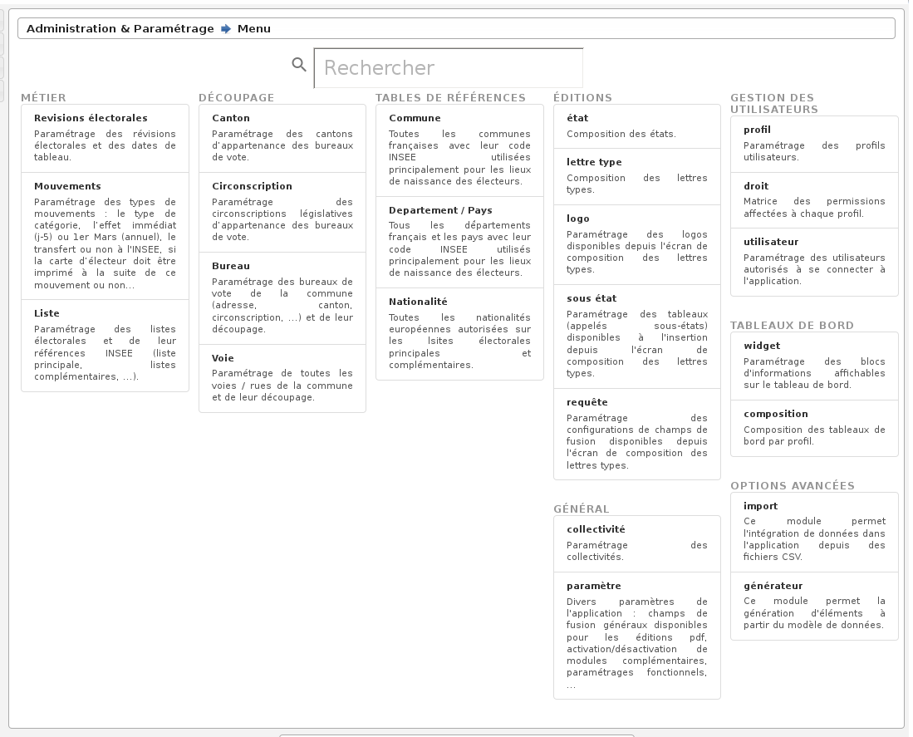

.. _administration:

##############
Administration
##############

   Menu - Rubrique 'Administration'

Gestion des utilisateurs
========================

Ce paramétrage permet de créer, modifier ou supprimer des utilisateurs.

.. figure:: a_parametrage_utilisateurs.png

    Gestion des utilisateurs

En effet, pour ajouter un nouvel utilisateur, il suffit de cliquer sur
l'icone + en haut à gauche du tableau, pour obtenir un formulaire
d'insertion. En cliquant sur l'icone supprimer devant l'utilisateur,
on obtient un formulaire de suppression. Et enfin en cliquant sur le
nom de l'utilisateur, on obtient un formulaire de modification.

