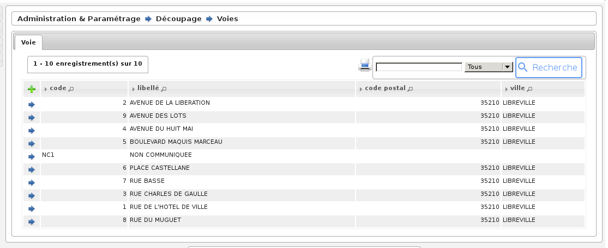

.. _administration_parametrage:

############################
Administration & Paramétrage
############################

   Menu - Rubrique 'Administration & Paramétrage'

Tous les paramétrages se font par l’intermédiaire de formulaires. Dans
l’optique openMairie, l’application présente un tableau permettant de choisir
l’enregistrement à modifier ou à supprimer, ou de créer un nouvel
enregistrement.

.. _administration_parametres:

Paramètres
==========

Divers paramètres de l’application sont configurables ici : champs de fusion généraux disponibles pour les éditions pdf, activation/désactivation de modules complémentaires, paramétrages fonctionnels, ...

* **option_double_emargement** : Double colonnes sur l'émargement. Les valeurs possibles sont : *true* double colonne, *false* simple colonne. La valeur par défaut est *false*.

* **option_tri_liste_emargement** : La liste d'émargement peut être dressée par ordre des numéros d'inscription ou par ordre alphabétique des électeurs, au choix de la mairie. Les valeurs possibles sont : *alpha* tri par ordre alphabétique, *numero* tri par numéros d'inscription. La valeur par défaut est *alpha*.

* **option_refus_mouvement** : Possibilité de choisir si les courriers de refus de mouvement sont disponibles dans l'application. Les valeurs possibles sont : *false* refus de mouvement non disponibles, *true* refus de mouvement disponibles. La valeur par défaut est *true*.

* **option_code_voie_auto** : Possibilité de choisir si les codes voie sont automatiques ou non. Les valeurs possibles sont : *false* les codes voies ne sont pas automatiques, *true* les codes voie sont automatiques. La valeur par défaut est *true*.

* **option_code_barre** : Affichage des codes barres sur la carte électorale. Les valeurs possibles sont : *true* affichage, *false* pas d'affichage. La valeur par défaut est *false*.

* **carte_electorale_texte_cachet_de_la_mairie** : Si ce paramètre est défini alors on positionne celui là dans la zone cachet de la mairie de la carte électorale sinon c'est le paramètre **ville** qui est utilisé. L'objectif de cette possible surcharge est de pouvoir aujster le libellé pour gérer les sauts de ligne en plein milieu des mots.

* **option_commission_sans_modification** : Les mouvements de modfication qui n'entraînent pas de changement de bureau n'apparaissent pas dans les listings pour la commission. Les valeurs possibles sont : *true* sans les modifications qui n'entrainent pas de changement de bureau, *false* avec les modifications qui n'entrainent pas de changement de bureau. La valeur par défaut est *true*.

* **parametrage_mouvement_venantautrecommune** : Code du type de mouvement obligeant la saisie d'une commune de provenance. La valeur par défaut est *CC*.

* **parametrage_mouvement_inscriptionoffice** : Code du type de mouvement pour les inscriptions d'office. La valeur par défaut est *IO*.

* **parametrage_etiquettes** : Paramétrage des planches d'étiquettes générées par openElec. Les valeurs par défaut sont : ::

    etiquette_bordure_etiquette=1
    etiquette_bordure_texte=0
    planche_marge_ext_haut=1
    planche_marge_ext_gauche=0
    planche_nb_colonnes=2
    planche_nb_lignes=7
    etiquette_largeur=105
    etiquette_hauteur=42
    etiquette_marge_int_haut=8
    etiquette_marge_int_gauche=8
    etiquette_marge_int_droite=8
    etiquette_espace_entre_colonnes=0
    etiquette_espace_entre_lignes=-1
    etiquette_hauteur_de_ligne_du_texte=4
    etiquette_taille_du_texte=10

* **option_generation_multi_as_an_archive** : Possibilité de réaliser la génération des éditions au format zip ou fichier par fichier. Cette option n'est nécessaire que pour le mode MULTI. Les valeurs possibles sont : *false* fichiers pdf séparés, *true* fichiers pdf dans une archive zip. La valeur par défaut est *true*.

* **parametrage_facturation** : Paramétrage des données pour l'export des données de facturation. Ce paramétrage n'est nécessaire que pour le mode MULTI. Les valeurs par défaut sont : ::

    fact_gestionnaire=A304
    fact_attributaire=A304
    fact_chapitre=70/7087801
    fact_electeur_unitaire=.28
    fact_forfait=30.49

.. _administration_utilisateurs:

Gestion des utilisateurs
========================

Ce paramétrage permet de créer, modifier ou supprimer des utilisateurs.

    Gestion des utilisateurs

En effet, pour ajouter un nouvel utilisateur, il suffit de cliquer sur
l'icone + en haut à gauche du tableau, pour obtenir un formulaire
d'insertion. En cliquant sur l'icone supprimer devant l'utilisateur,
on obtient un formulaire de suppression. Et enfin en cliquant sur le
nom de l'utilisateur, on obtient un formulaire de modification.

.. _administration_param_mouvements:

Paramétrage des mouvements
==========================

Ce paramétrage est très important, il permet de régler les catégories et les
paramètres des mouvements. ces paramètres sont les suivants : le type de
catégorie, l'effet immédiat (j-5) ou 1er Mars (annuel), le transfert ou
non au CNEN, si la carte d'électeur doit être imprimé à la suite de ce
mouvement ou non. L'ajout, modification ou suppression de ces paramètres se
fait de la même manière que le paramétrage des utilisateurs.

    Rubrique Parametrage : Mouvements

Paramétrage des mouvements pour import radiations INSEE
-------------------------------------------------------

Un paramétrage correct des types de mouvements permet de sélectionner de manière automatique le motif de radiation
en fonction des données transmises par l'INSEE, lors de la validation de la demande de radiation.

Lorsque vous recevez les radiations INSEE, le motif de radiation est inscrit sous forme de numéro :

* 0 - inscription d'office dans une autre commune
* 1 - décès
* 2 - changement de commune d'inscription (nouvelle inscription sur décision de la commission administrative)
* 3 - changement de commune d'inscription (nouvelle inscription sur décision judiciaire)
* 4 - n'a pas atteint l'âge électoral
* 5 - état civil incontrolable
* 6 - inscription volontaire annulant l'inscription d'office dans votre commune
* 7 - décision de tutelle privative de la capacité électorale
* 8 - condamnation privative de la capacité électorale
* 9 - perte de nationalité française

Il suffira donc de choisir le mouvement et cocher la case du chiffre qui correspond au mouvement. Par exemple
le mouvement "DECES INSEE" correspond au chiffre 1.

Le découpage inclut plusieurs notions: le canton, le bureau, la voie.
Chaque bureau appartient à un canton, et chaque voie appartient à un bureau
d'un numéro de cette voie à un autre numéro. Cela permet lorsque toutes les
voies sont correctement saisies d'affecter un électeur à son bureau en
fonction de son adresse.

Les trois paramétrages sont identiques aux paramétrages vus précédemment :
ajout, suppression, modification.

.. _administration_voies:

Voies et découpage
==================

Seule l'association de voies à un bureau est légèrement différente comme on
peut le voir sur la figure suivante. Lorsque l'on modifie, une voie on peut
visualiser un tableau supplémentaire qui associe cette voie à un bureau.
En cliquant sur le + on ajoute, une association (ex : rue de la république
du n°1 à 500 => bureau 1, du n°501 à 1000 > bureau 2), on peut modifier ou
supprimer comme tous les paramétrages précédents.

    Rubrique Decoupage : Voie

    Rubrique Decoupage : Découpage

Paramétrage de l'envoi de notification par courriel aux utilisateurs
=====================================================================

Ce paramétrage permet l'envoi de notification par courriel aux utilisateurs 
choisis en fonction de leurs profils. Il est accéssible dans la partie métier
du menu 'Administration & Paramétrage'.

Pour sélectionner les profils il faut cliquer sur le lien "Définir/Modifier" ce 
qui ouvre un overlay avec la liste des profils. Il est possible de sélectionner 
plusieurs profils en restant apppuyé sur le bouton [Ctrl] du clavier et en cliquant 
sur les profils que l'on veut choisir. Il faut ensuite cliquer sur le bouton "Valider" 
pour enregistrer les profils.

Un aperçu du courriel qui va être envoyé est affiché en dessous de la liste des 
profils sélectionnés. Il ne s'affiche que lorsque il y a des tâches en cours à effectuer.

Le bouton "Tester l'envoi" permet d'envoyer un courriel de test à condition que des profils 
soient sélectionnés et que des tâches en cours doivent être effectuées.

Lorsque l'application est en mode MULTI, il n'y a pas d'aperçu de message, l'utilisateur peut 
choisir les profils qui seront sélectionnés si les commune n'ont pas de profils sélectionnés 
dans leurs paramétrage spécifique et lancer le traitement d'envoi de notification par courriel sur 
toute les communes gérées.

