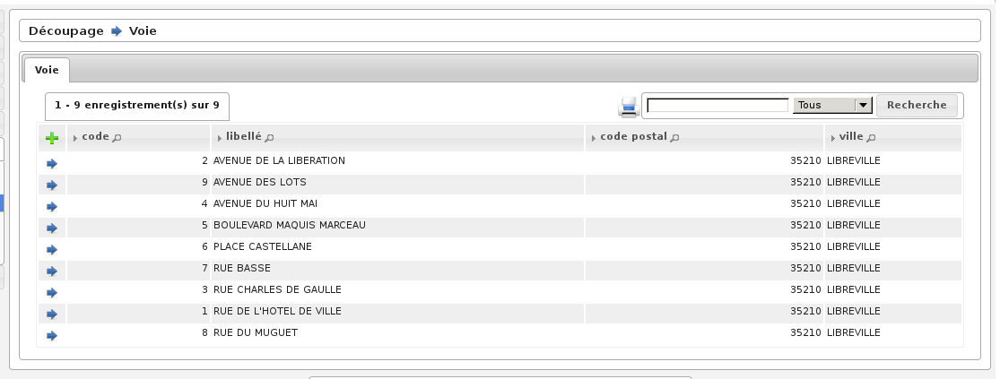
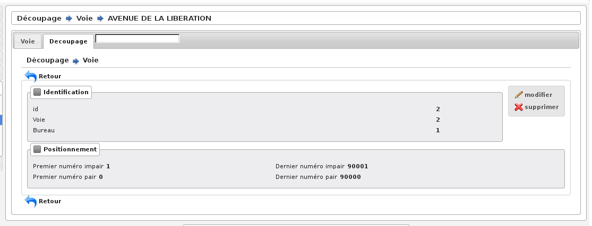

.. _decoupage:

#########
Découpage
#########

Le découpage inclut plusieurs notions: le canton, le bureau, la voie.
Chaque bureau appartient à un canton, et chaque voie appartient à un bureau
d'un numéro de cette voie à un autre numéro. Cela permet lorsque toutes les
voies sont correctement saisies d'affecter un électeur à son bureau en
fonction de son adresse.

Les trois paramétrages sont identiques aux paramétrages vus précédemment :
ajout, suppression, modification.

.. note:: Depuis début 2015 les codes cantons sont obligatoires dans l'export préfecture de la liste électorale, ils peuvent être modifiés lors de l'édition des cantons.

Seule l'association de voies à un bureau est légèrement différente comme on
peut le voir sur la figure suivante. Lorsque l'on modifie, une voie on peut
visualiser un tableau supplémentaire qui associe cette voie à un bureau.
En cliquant sur le + on ajoute, une association (ex : rue de la république
du n°1 à 500 => bureau 1, du n°501 à 1000 > bureau 2), on peut modifier ou
supprimer comme tous les paramétrages précédents.

    Rubrique Decoupage : Voie

    Rubrique Decoupage : Découpage
