.. _fiches_pratiques:

################
Fiches pratiques
################

.. contents::

***********************************************************************
Saisie et édition des tableaux des additions : jeunes de 18 ans (L11-2)
***********************************************************************

Intégrer les jeunes IO au tableau du 10 janvier 2015 pour les élections départementales
=======================================================================================

Gestion de l'article L11-2 deuxième alinéa pour un scrutin général organisé 
en mars.

Que se passe-t-il ?
-------------------

Vous allez prochainement recevoir de l'INSEE ou avez reçu de l'INSEE, une 
liste de jeunes qui auront 18 ans entre le 1er mars 2014 et le 21 mars 2015,
c'est-à-dire au jour du 1er tour de scrutin des élections départementales.

Ces jeunes doivent faire l'objet d'une inscription d'office au titre de 
l'article L.11-2 2ème alinéa du code électoral, sous réserve des vérifications
habituelles. Ils seront inscrits comme tout nouvel inscrit sur le tableau du 
10 janvier 2015 et seront ajoutés après la clôture des listes du 1er mars.

Ces inscriptions n'entrent en vigueur que le 22 mars 2015. Elles seront donc 
traitées lors du traitement J-5 des élections départementales le 17 mars 2014.
Pour cela, il vous faut saisir ces inscriptions d'office à la date de tableau
du 10/01/2015 puisqu'ils entrent dans la révision électorale 2014/2015.

La commission administrative devra être convoquée en réunion normale au plus
tard le 9 janvier 2015. Le tableau rectifictif pourra être édité comme vous avez 
l'habitude de le faire depuis l'écran 'Traitement -> Commission' ou depuis
l'écran 'Edition -> Révision électorale'.

Comment faire ?
---------------

* Vérifier que la date de tableau est bien positionnée au 10/01/2015 sinon 
  changer la date de tableau au 10/01/2015.

* Procéder à l'inscription des jeunes inscrits d'office comme vous avez 
  l'habitude de le faire (soit depuis l'import IO du module INSEE, soit en 
  saisie directe) en veillant à sélectionner le type de mouvement « IO 18 ANS 
  01/03 -> 21/03/2015 (L11-2) ».

* Une fois tous les mouvements saisis, ces mouvements seront présents dans le
  tableau rectificatif à présenter en commission comme vous avez l'habitude 
  de le faire. Vous pouvez également éditer le tableau des additions via le 
  menu « Edition → Révision électorale ». Dans la section « Tableau des 
  additions », cliquer sur l'édition « Tableau (par bureau) » en dessous de la
  mention « IO 18 ANS 01/03 -> 21/03/2015 (L11-2) ». 

* Repositionner la date de tableau si vous l'avez changé lors de la première
  étape.

Et après ?
----------

Ces inscriptions seront ajoutées sur la liste électorale au moment du traitement
J-5 qui aura lieu 5 jours avant les élections municipales le 17 mars 2015. En 
effet, ces inscriptions ne seront pas appliquées lors du traitement annuel du 
10/01. Par exemple, si vous arrêtez votre tableau à 9542 électeurs et que vous
avez 8 jeunes concernés, après le traitement annuel du 10/01 votre liste 
électorale comptera 9534 électeurs correspondants à 9542 moins 8 qui seront 
intégrés au moment du J-5.

******************************************
Traitement des cinq jours avant l'élection
******************************************

Effectuer le traitement J-5 pour les élections départementales 2015
===================================================================

Que se passe-t-il ?
-------------------

Le "traitement J-5" permet d'appliquer les rectifications intervenues depuis la
clôture des listes ou depuis le dernier scrutin postérieur à cette clôture 
(tableau des cinq jours), ainsi que les additions opérées au titre du deuxième
alinéa de l'article L. 11-2 (tableau des additions). 

C'est un traitement particulier qui permet de constituer la liste électorale qui 
entre en vigueur à la date de l'élection générale. 

Pour l'élection départementale du 22 mars 2014, il va vous falloir effectuer deux 
traitements J-5 :

* Le 1er pour intégrer les **jeunes de 18 ans nés entre le 1er mars et le 21 mars 
  1997**, et ce au **tableau du 10/01/2015**,

* le 2nd pour appliquer les **rectifications intervenues depuis la clôture des 
  listes au 28/02/2015**. Ce second J-5 devra être effectué à la date de **tableau 
  du 10/01/2016**.

1er traitement pour les mouvements « IO 18 ANS 01/03 -> 22/03/2015 (L11-2) »
----------------------------------------------------------------------------

1. Positionner la date de tableau au **10/01/2015**.

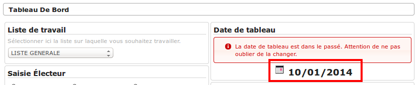

2. Se rendre sur l'écran (:menuselection:`Traitement --> Traitement J-5`).

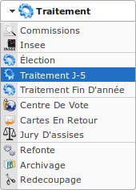

3. Dans la section `Étape 1`, cocher la case (1) du type de mouvement qui entre en
   vigueur à la date de l'élection mais en date de tableau du 10/01/2014 soit
   **Tableau des additions - IO 18 ANS 01/03 -> 22/03/2015 (L11-2)** et 
   uniquement celle-ci et cliquer sur le bouton `Valider la sélection` (2).

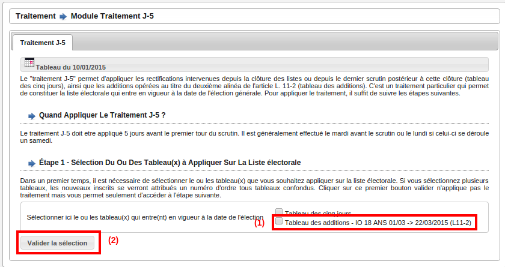

4. Dans la section `Étape 2 - vérification et application du traitement j-5`,
   d'abord cliquer sur le lien (1) `Cliquer ici pour visualiser le 
   recapitulatif complet du traitement` puis cliquer sur le bouton `Appliquer 
   le traitement J-5`.

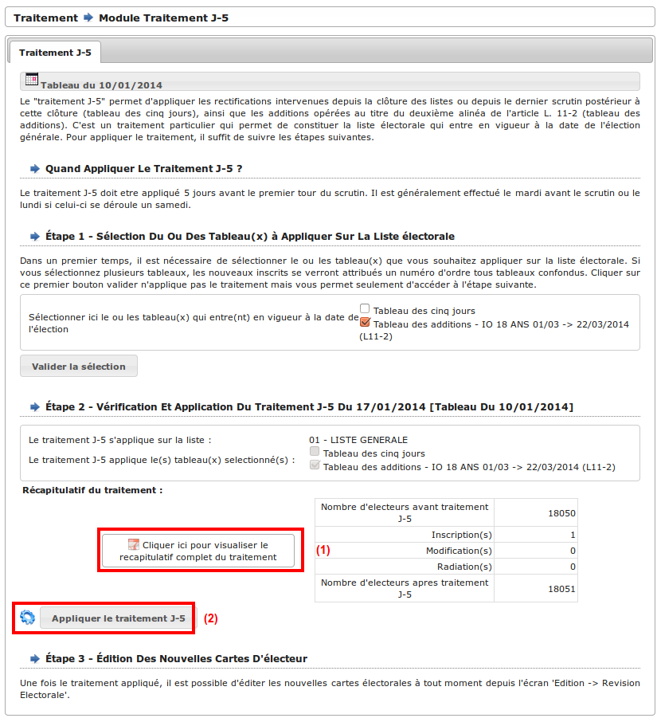

5. Confirmer le traitement en cliquant sur "OK".

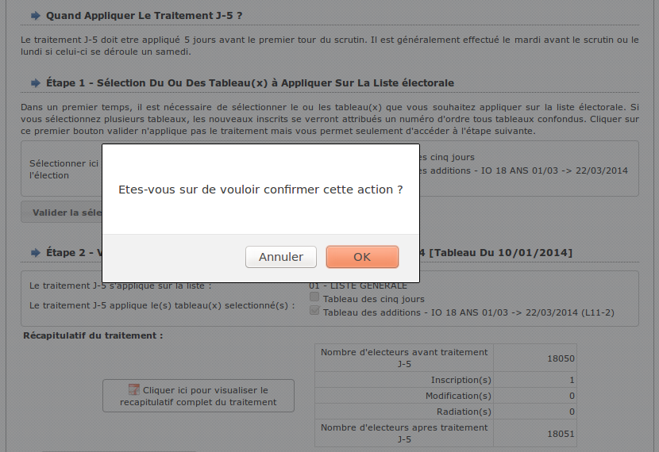

6. Vérifier que le message **Le traitement est terminé** apparaît.

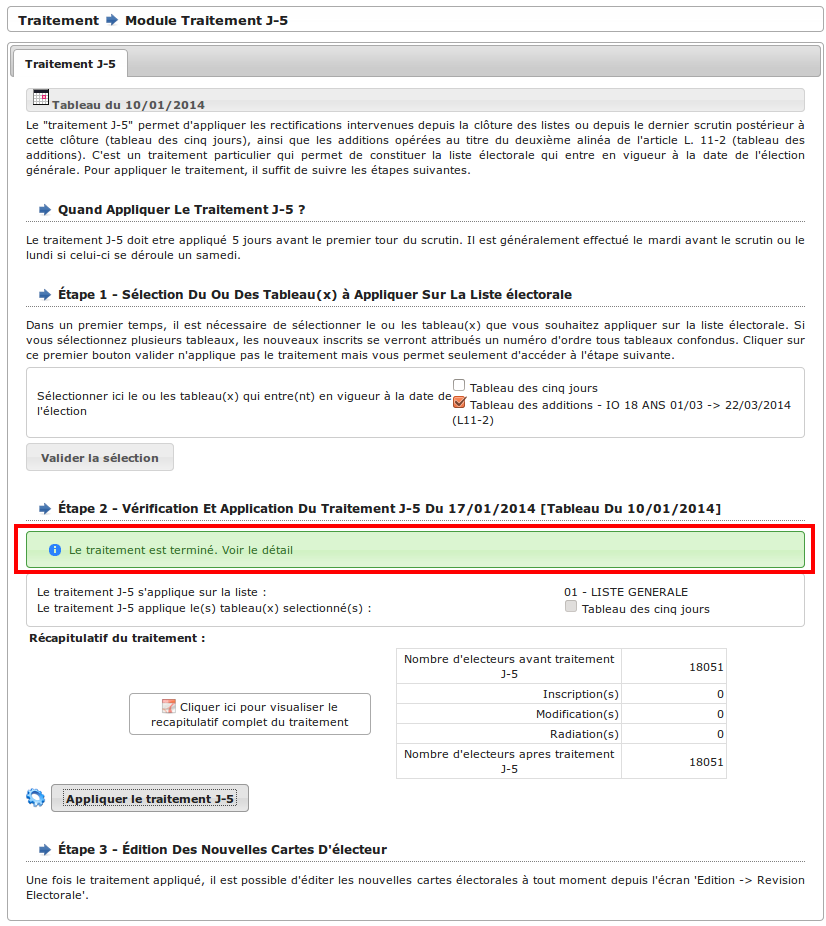

7. Dans la section `Étape 3 - Édition des nouvelles cartes d'électeurs`, on 
   peut lire qu'il est possible d'éditer à tout moment les nouvelles cartes 
   électorales depuis l'écran 
   (:menuselection:`Édition --> Révision électorale`)

8. Repositionner la date de tableau au **10/01/2016**.

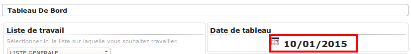

2nd traitement pour les mouvements au 10/01/2016
------------------------------------------------

1. Vérifier que la date de tableau est bien au **10/01/2016**.

2. Se rendre sur l'écran (:menuselection:`Traitement --> Traitement J-5`).

3. Dans la section `Étape 1`, cocher la case (1) du tableau des cinq jours et 
   uniquement celle-ci puis cliquer sur le bouton `Valider la sélection` (2).

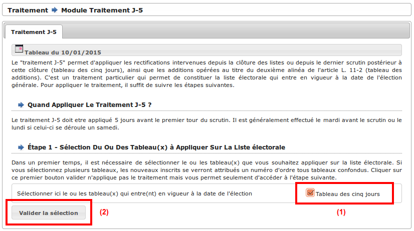

4. Dans la section `Étape 2 - vérification et application du traitement j-5`,
   d'abord cliquer sur le lien (1) `Cliquer ici pour visualiser le 
   recapitulatif complet du traitement` puis cliquer sur le bouton `Appliquer 
   le traitement J-5`.

.. image:: traitementj5_trt2_validertraitement.png

5. Confirmer le traitement en cliquant sur "OK".

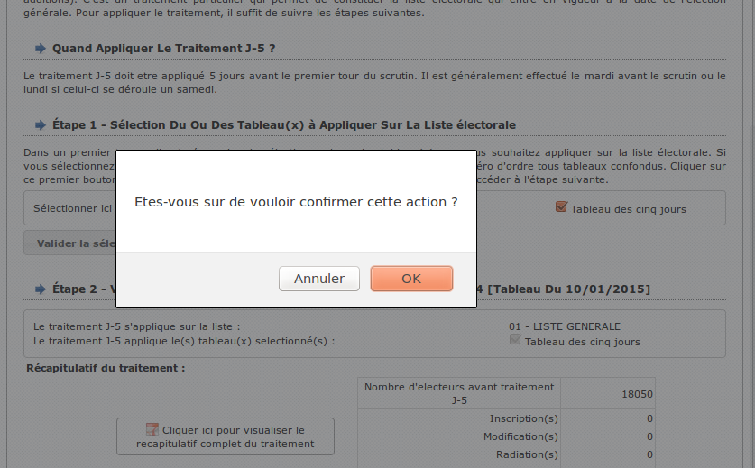

6. Vérifier que le message **Le traitement est terminé** apparaît.

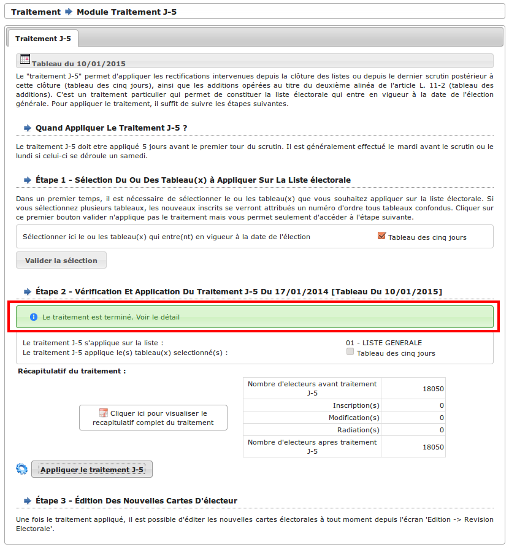

7. Dans la section `Étape 3 - Édition des nouvelles cartes d'électeurs`, on 
   peut lire qu'il est possible d'éditer à tout moment les nouvelles cartes 
   électorales depuis l'écran 
   (:menuselection:`Édition --> Révision électorale`)
   
   
************************************************
Que faire après le traitement du 28 février 2016
************************************************

Au préalable
============

1 - J'ai envoyé à l'INSEE le fichier des mouvements rectificatifs : traitement -> INSEE -> Export -> Génération du fichier Export INSEE
2 - J'ai effectué le traitement annuel au 29/02/2016 SUR LES TROIS LISTES: traitement -> traitement de fin d'année -> Appliquer le traitement annuel
3 - J'ai changé ma date de tableau au 10/01/2017 : Tableau de bord -> cliquez sur la date de tableau -> saisissez la nouvelle date : 10/01/2017

Je dois envoyer les tableaux de commission au 29/02/2016 à la Préfecture et éditer les cartes des nouveaux électeurs
--------------------------------------------------------------------------------------------------------------------

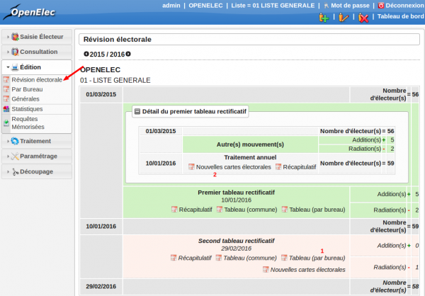

Editions - Révision électorale - second tableau rectificatif (pour les tableaux)

1 - Cliquez sur tableau (par bureau) dans le second tableau rectificatif

Editions - Révision électorale - traitement annuel du 10/01/2016 (pour les cartes)

2 - Cliquez sur "nouvelles cartes électorales"

Je dois envoyer les listes électorales à la Préfecture
------------------------------------------------------

.. image:: traitement28fevrier_moduleprefecture.png

Traitement - Préfecture
POUR CHACUNE DES 3 LISTES :

    Choisir la liste sur laquelle vous devez exporter la liste électorale

1 - Choisir le format CSV
2 - Cliquez sur le bouton "génération du fichier"
3 - Cliquez "droit" avec votre souris sur le fichier dont la date correspond à la date du jour (date et heure) et cliquez sur "enregistrer la
cible du lien sous" NE CHANGEZ PAS LE NOM DU FICHIER ET NE PAS L'OUVRIR AVANT DE L'ENREGISTRER

Effectuez la même opération pour les 3 listes

    la liste générale s'appellera "liste P date du jour + heure "
    la liste Complémentaire CEuropéenne s'appellera "liste CE date du jour + heure "
    la liste Complémentaire Municipale s'appellera "liste CM date du jour + heure"

Je dois envoyer les statistiques à la Préfecture
------------------------------------------------

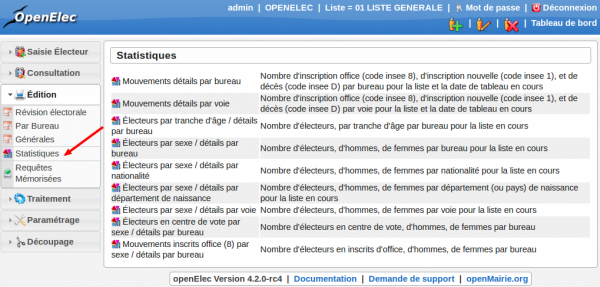

Edition - Statistiques

Je dois éditer la liste générale
---------------------------------

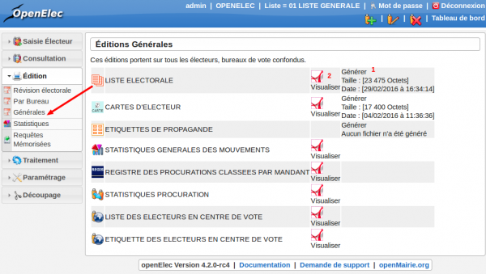

Editions - Générales
POUR CHACUNE DES 3 LISTES :

    Choisir la liste sur laquelle vous devez exporter la liste électorale

1 - Cliquer sur "générer" pour que la liste générale soit générée à la date
du jour
2 - Cliquer sur le bouton "visualiser"

Effectuez la même opération pour les 3 listes
