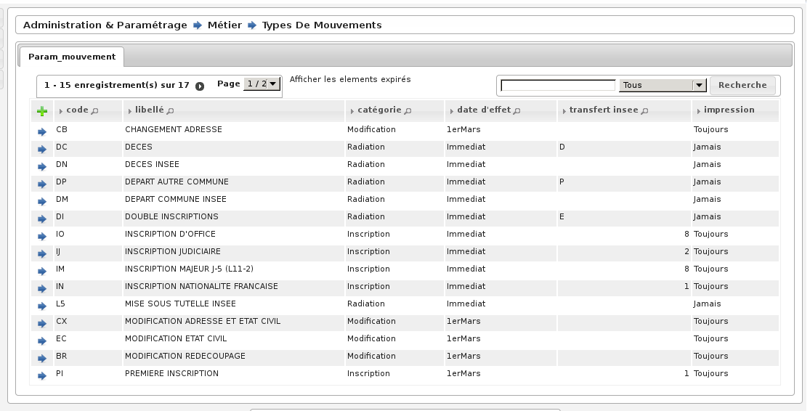

.. _parametrage:

###########
Paramétrage
###########

.. figure:: a_menu-rubrik-parametrage.png

   Menu - Rubrique 'Paramétrage'

Tous les paramétrages se font par l’intermédiaire de formulaires. Dans
l’optique openMairie, l’application présente un tableau permettant de choisir
l’enregistrement à modifier ou à supprimer, ou de créer un nouvel
enregistrement.

Paramétrage des mouvements
==========================

Ce paramétrage est très important, il permet de régler les catégories et les
paramètres des mouvements. ces paramètres sont les suivants : le type de
catégorie, l'effet immédiat (j-5) ou 1er Mars (annuel), le transfert ou
non au CNEN, si la carte d'électeur doit être imprimé à la suite de ce
mouvement ou non. L'ajout, modification ou suppression de ces paramètres se
fait de la même manière que le paramétrage des utilisateurs.

    Rubrique Parametrage : Mouvements

Paramétrage des mouvements pour import radiations INSEE
-------------------------------------------------------

Un paramétrage correct des types de mouvements permet de sélectionner de manière automatique le motif de radiation
en fonction des données transmises par l'INSEE, lors de la validation de la demande de radiation.

Lorsque vous recevez les radiations INSEE, le motif de radiation est inscrit sous forme de numéro :

* 0 - inscription d'office dans une autre commune
* 1 - décès
* 2 - changement de commune d'inscription (nouvelle inscription sur décision de la commission administrative)
* 3 - changement de commune d'inscription (nouvelle inscription sur décision judiciaire)
* 4 - n'a pas atteint l'âge électoral
* 5 - état civil incontrolable
* 6 - inscription volontaire annulant l'inscription d'office dans votre commune
* 7 - décision de tutelle privative de la capacité électorale
* 8 - condamnation privative de la capacité électorale
* 9 - perte de nationalité française

Il suffira donc de choisir le mouvement et cocher la case du chiffre qui correspond au mouvement. Par exemple
le mouvement "DECES INSEE" correspond au chiffre 1.

