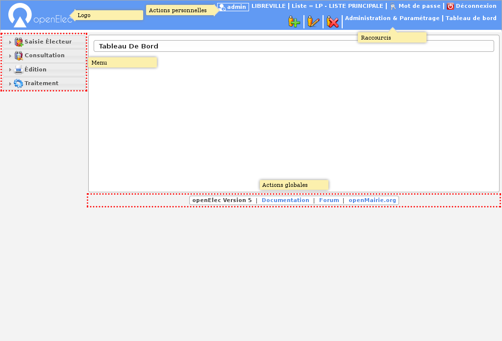
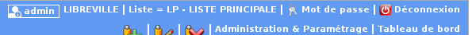
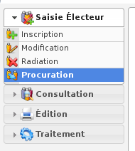
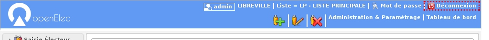
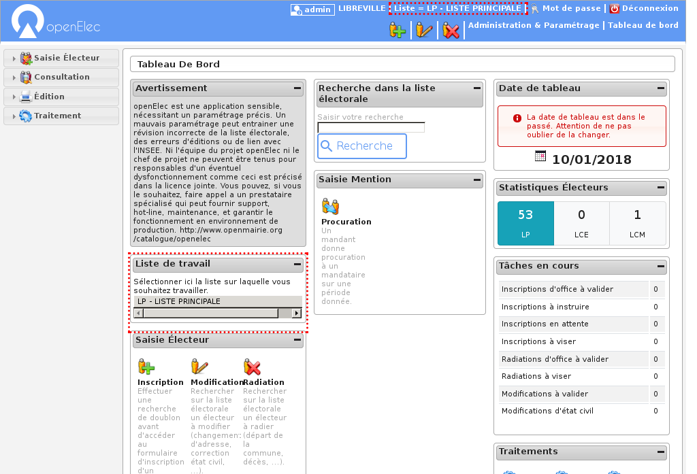

.. _preambule:

#########
Préambule
#########

************
Présentation
************

============
Introduction
============

openElec est un logiciel qui permet la gestion des listes électorales (listes
politiques). Il permet de traiter et de gérer facilement les listes
d'émargement (pdf), les cartes d'électeurs (pdf), les procurations, les centres
de vote, les mairies européennes, les étiquettes pour la propagande (pdf), les
listes d'électeurs, les listes annuelles des mouvements, les statistiques, les
envois à l'insee, l'import des inscriptions d'office, les tableaux de fin
d'année, les tableaux j-5, la gestion du découpage des voies.

==========
Historique
==========

Ce logiciel a été développé par la Direction des Systèmes d'Informations et de
Télécommunications de la Mairie d'Arles en 2005 pour son service élections. Ce
logiciel dépend du framework openMairie, qui est un ensemble de bibliothèques
permettant le développement rapide d'applications métiers pour les
collectivités locales.

openElec a remporté le trophée d'or aux trophées du libre 2006 dans le cadre du
concours international organisé par le CETRIL.

Depuis 2006, openElec a évolué pour se plier aux nouvelles règlementations du
code électoral, mais aussi pour améliorer son ergonomie.

===========================
Caractéristiques techniques
===========================

Ce logiciel est développé en PHP (PHP est un langage de scripts libre
principalement utilisé pour être exécuté par un serveur Web) et utilise
une base de données PostgreSQL. openElec dépend de plusieurs composants PHP :

* le framework openMairie,

* l'abstracteur de base de données DB du framework PEAR,

* le générateur de documents pdf FPDF.

Cette interface Web permet donc au logiciel d'être facilement utilisé en local
comme à distance.

********************************
Sensibilisation des utilisateurs
********************************

Ce logiciel, comme la plupart des logiciels openMairie, demande une grande
rigueur d'utilisation. En effet, cette application étant une solution Web,
certaines actions sont permises à l'utilisateur alors qu'elles pourraient
altérer les données de l'application :

* il ne faut en aucun cas cliquer sur l'icône « Précédent » ou « Suivant » du navigateur Web,

* il faut faire toujours très attention à la liste par défaut sur laquelle on travaille pour ne pas faire des modifications sur la mauvaise liste,

* il faut faire très attention à la date de tableau pour que les mouvements soient associés aux bons traitements.

.. _ergonomie:

******************
Ergonomie générale
******************

L'application, sur la grande majorité des écrans, conserve ses composants
disposés exactement au même endroit. Nous allons décrire ici le fonctionnement
et l'objectif de chacun de ces composants. Cette structuration de l'application
permet donc à l’utilisateur de toujours trouver les outils au même endroit
et de se repérer rapidement.

    Ergonomie générale

.. note::

    Les actions et affichages de l'application diffèrent en fonction du profil
    de l'utilisateur. Il se peut donc que dans les paragraphes qui suivent
    des actions soient décrites et n'apparaissent pas sur votre interface
    ou inversement que des actions ne soient pas décrites mais apparaissent sur
    votre interface.

=======
Le logo
=======

C'est le logo de l'application, il vous permet en un seul clic de revenir
rapidement au tableau de bord.

    Logo

========================
Les actions personnelles
========================

Cet élément affiche plusieurs informations importantes.

La première information est l'identifiant de l'utilisateur actuellement
connecté ce qui permet de savoir à tout moment si nous sommes bien connectés
et avec quel utilisateur. Ensuite est noté le nom de la collectivité sur
laquelle nous sommes en train de travailler. En mode multi, une action est
disponible sur cette information pour permettre de changer de collectivité.
Ensuite la liste sur laquelle nous sommes en train de travailler, une action
est disponible sur cette information pour permettre de changer de liste.
Enfin l'action pour permettre de changer de mot de passe et pour se déconnecter
sont disponibles en permanence.

    Actions personnelles

==============
Les raccourcis
==============

Cet élément permet d'afficher des raccourcis vers des écrans auxquels nous
avons besoin d'accéder très souvent. Par exemple, ici nous avons des
raccourcis directs vers les formulaires d'inscription, de modification et de
radiation d'un électeur ainsi qu'un lien vers le tableau de bord.

    Raccourcis

=======
Le menu
=======

Cet élément permet de classer les différents écrans de l'application en
rubriques. En cliquant sur l'entête de rubrique, nous accédons à la liste des
écrans auxquels nous avons accès dans cette rubrique.

Le nombre de rubriques disponibles dans le menu peut varier en fonction du
profil des utilisateurs. Un utilisateur ayant le profil Consultation n'aura
probablement pas accès aux six rubriques présentes sur cette capture.

    Menu

====================
Les actions globales
====================

Cet élément permet d'afficher en permanence le numéro de version du logiciel.
Ensuite les différentes actions sont des liens vers le site officiel du
logiciel ou vers la doucmentation.

    Actions globales

.. _connexion_deconnexion:

*********************
Connexion/Déconnexion
*********************

=========
Connexion
=========

.. note::

   Pour réaliser cette étape, votre administrateur doit vous fournir une
   adresse Web pour accéder à l'application, un identifiant utilisateur ainsi
   qu'un mot de passe. Ces éléments auront été préalablement configuré dans
   le logiciel.

Navigateur Web
==============

L'application est accessible via un navigateur Web, pour y accéder il faut
saisir l'adresse Web fournie par votre administrateur dans la barre d'adresse.

    Saisie d'adresse dans un navigateur Web

.. note::

    Ce logiciel est développé principalement sous le navigateur Mozilla Firefox,
    il est donc conseillé d'utiliser ce navigateur pour une efficacité optimale.

Saisie des informations de connexion
====================================

Cet écran de connexion est composé de deux zones de texte et d'un bouton.

    Formulaire de connexion

La figure 2 présente l'écran d'identification, il faut saisir son identifiant et
son mot de passe puis cliquer sur le bouton « Se connecter ».

.. note::

    L'identifiant et le mot de passe doivent être saisis en respectant la
    casse, c'est-à-dire les minuscules et majuscules.

Connexion échouée
-----------------

Si les identifiants saisis sont incorrects, un message d'erreur apparaît et il
faut ressaisir les informations de connexion.

    Message de connexion échouée

Connexion réussie
-----------------

Si les identifiants sont corrects, vous êtes redirigé vers la page demandée sur
laquelle le message suivant doit d'afficher.

    Message de connexion réussie

===========
Déconnexion
===========

Pour une question de sécurité évidente, il est important de se déconnecter de
l'application pour qu'aucun autre utilisateur ne puisse pas accéder au logiciel
via votre compte utilisateur.

L'action "Déconnexion" est disponible à tout moment dans les actions
personnelles en haut à droite de l'écran.

   Action "Déconnexion" dans la barre d'actions personnelles

Une fois déconnecté, c'est le formulaire de donnexion qui s'affiche avec un
message expliquant la réussite de la déconnexion.

    Message de déconnexion réussie

.. _tableau_de_bord:

***************
Tableau de bord
***************

Le tableau de bord est composé de plusieurs blocs d'informations appelés widget qui permettent à l'utilisateur de visualiser rapidement des informations transverses.

La disposition des widgets est propre à chaque profil et peut être modifiée très facilement par l'administrateur. Il est donc possible pour les services de modifier la disposition (suppression de widget / déplacement de widget).

=======
Widgets
=======

- Widget 'Avertissement'
- Widget 'Raccourcis'
- Widget 'Liste de travail'
- Widget 'Collectivité de travail'
- Widget 'Recherche dans la liste électorale'
- Widget 'Date de tableau'

**************************************
Les droits et profils des utilisateurs
**************************************

Chaque utilisateur est associé à un profil. Le profil est le niveau de droits
de l'utilisateur, dans la configuration par défaut d'openElec, il existe cinq
profils :

#. Consultation,

#. Utilisateur limité,

#. Utilisateur,

#. Super utilisateur,

#. Administrateur.

Chaque page de l'application est associée à un profil. Pour chaque accès à une
page, l'application vérifie si l'utilisateur a un profil supérieur ou égal au
profil de la page consultée, si c'est le cas l'utilisateur à donc le droit
d'accéder aux informations.

******************
L'année électorale
******************

    Année électorale

*****************
La liste en cours
*****************

=========================
A quoi sert cette liste ?
=========================

Il existe dans le système électoral trois listes : la liste générale, la liste
européenne, la liste municipale européenne. Les citoyens de l'Union européenne
qui souhaitent s'inscrire sur les listes doivent le faire à la mairie de leur
domicile sur une liste électorale complémentaire. Il existe deux listes
électorales complémentaires distinctes, l'une valable pour les élections
municipales, l'autre valable pour les élections européennes.

openElec travaille sur une seule liste à la fois en ce qui concerne les
inscriptions, radiations, modifications, traitements, éditions, ... Il faut
donc selon le besoin savoir sur quelle liste on travaille, et comment on
change de liste.

===========================
Consulter la liste en cours
===========================

Cette information est en permanence affichée à l'écran, sur la droite, en haut
de la page à côté du login. Cela permet de savoir en un coup d'oeil sur quelle
liste on est en train de travailler.

    Liste en cours

==========================
Modifier la liste en cours
==========================

Pour modifier la liste, il suffit de cliquer sur la liste. Une liste de choix
nous permet de sélectionner la liste sur laquelle on veut travailler.

.. _la_date_de_tableau:

******************
La date de tableau
******************

========================
A quoi sert cette date ?
========================

La date de tableau est la date à laquelle sera effectuée le prochain
traitement. Elle permet lors de la saisie de mouvements de lier ce mouvement
à un traitement. Il ne peut y avoir qu'une seule date de tableau à la fois soit :

* le tableau du 10 janvier qui concerne l'ensemble des mouvements (inscriptions, modifications, radiations),

* le tableau du 28 février qui concerne (généralement) les mouvements de radiations.

=========================
Consulter la date tableau
=========================

Pour consulter la date tableau, il suffit d'accéder au tableau de bord de l'application. La date de tableau y est affichée.

    Consultation de la date de tableau

========================
Modifier la date tableau
========================

Pour modifier la date de tableau en cours, il suffit de cliquer sur la date de tableau affichée sur le tableau de bord, de la modifier et ensuite valider la modification.

    Modifier la date de tableau
