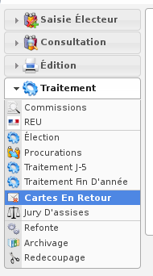
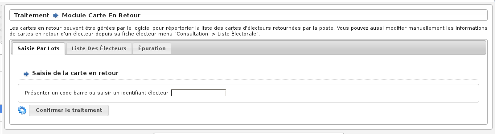

#######################
Module Cartes en Retour
#######################

Le module Cartes en Retour est accessible via le menu
(:menuselection:`Traitement --> Cartes en Retour`).

.. contents::

Les cartes en retour peuvent être gérées par le logiciel pour répertorier
la liste des cartes d'électeurs retournées par la poste. Vous pouvez aussi
modifier manuellement les informations de cartes en retour d'un électeur
directement depuis sa fiche d'électeur en cliquant sur "Enregistrer une
carte en retour pour cet électeur".

Le module traitement-cartes en retour, permet soit d'inscrire le numéro
d'électeur, soit de scanner le code inscrit sur la carte, si vous avez
une douchette.

    Ecran du module : Cartes en Retour
