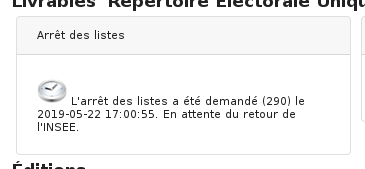

##################
Module "Élections"
##################

Le module "Élections" est accessible via le menu
(:menuselection:`Traitement --> Élection`).

.. image:: a_module_election_menu.png

.. contents::

Les scrutins
############

Les scrutins sont disponibles dans le menu traitement - Election.
Pour récupérer les scrutins en cours, il faut synchroniser les scrutins en cliquant sur le bouton "Synchroniser".

.. image:: a_module_election_scrutin_synchronisation.png

Après avoir synchronisé les scrutins, on peut accéder à ceux-ci dans le listing.

Attention : pour synchroniser les scrutins il faut impérativement avoir fait la synchronisation des listes électorales et la refonte.

Les demandes de livrables auprès du Répertoire Électoral Unique
###############################################################

Les demandes de livrable sont disponibles dans la fiche de l'élection souhaitée.

******************
L'arrêt des listes
******************

L'arrêt des listes doit s'effectuer après avoir fait votre commission.
Attention : l'arrêt des listes ne se demande qu'une seule fois, contrairement aux listes d'émargement par exemple.
L'arrêt des listes permet d'éditer la liste d'émargement, la liste électorale, le tableau des cinq jours.

L'action est disponible seulement entre J-23 et J-7 de la date de l'élection.
Si l'action n'est pas disponible nous avons un message dans le carré "Arrêt des listes" :

.. image:: a_module_election_scrutin_bloc_pas_propice_j20.png

Si l'action est diponible nous avons ce message dans le carré "Arrêt des listes" : 

.. image:: a_module_election_scrutin_bloc_propice_j20.png

Pour demander un arrêt des listes il faut se rendre dans l'élection en cours et cliquer sur l'action "Demander l'arrêt des listes".

.. image:: a_module_election_scrutin_action_j20.png

Le carré "Arrêt des listes" affiche un message indiquant que la demande de livrable a été envoyé au REU.

Attention : le fait de demander l'arrêt des listes sous-entend que le REU peut mettre un certain temps pour livrer les documents.

Lorsque la demande de livrable à été traitée par le REU, un message avec un picto vert s'affiche dans le carré "Arrêt des listes".

****************************
Le livrable "mouvements j-5"
****************************

Il est possible de récupérer le tableau des mouvements J-5 dans l'élection souhaitée.
L'action est disponible seulement entre J-6 et J-1 de la date de l'élection.
Si l'action n'est pas disponible nous avons un message dans le carré "Mouvements J-5" :

Si l'action est diponible nous avons ce message dans le carré "Mouvements J-5" : 

Pour demander un tableau des mouvements J-5 il faut se rendre dans l'élection en cours et cliquer sur l'action "Demander le livrable 'mouvements J-5'".

.. image:: a_module_election_scrutin_action_j5.png

Le carré "Mouvements J-5" affiche un message indiquant que la demande de livrable a été envoyé au REU.

Attention : le fait de demander le livrable "Mouvements J-5" sous entend que le REU peut mettre un certain temps pour livrer les documents.

Lorsque la demande de livrable à été traité par le REU, un message avec un picto vert s'affiche dans le carré "Mouvement J-5" nous indiquant que les documents sont disponible.

.. image:: a_module_election_scrutin_livrable_j5_valid.png

Il faut simplement cliquer sur le bouton "Télecharger" pour récupérer le tableau des mouvements J-5.

********************************
Le livrable "liste d'émargement"
********************************

Il est possible de récupérer la liste d'émargement dans l'élection souhaitée. 
Pour demander une liste d'émargement, il faut cliquer sur l'action "Demander le livrable 'liste d'émargement'".

.. image:: a_module_election_scrutin_action_emarge.png

Lorsque la demande de livrable à été traitée par le REU, un message avec un picto vert s'affiche dans le carré "Liste d'émargement" nous indiquant que les documents sont diponible.

.. image:: a_module_election_scrutin_livrable_emarge_valid.png

Les éditions
############

****************************************
Les éditions basées sur le livrable J-20
****************************************

.. warning::

   L'édition des listes électorales globales se base sur le livrable J-20 transmis par le REU.

L'accès aux éditions des listes électorales globales est possible seulement après avoir reçu du REU le livrable J-20 (arrêt des listes). Il faut simplement cliquer sur le bouton "Générer" de la liste souhaitée pour que le document soit téléchargeable depuis le lien télécharger.

**********************************************
Les éditions basées sur le livrable EMARGEMENT
**********************************************

.. warning::

   Les éditions disponibles dans la partie Liste d'émargement se basent sur le livrable émargement transmis par le REU.

Lorsque la demande de liste d'émargement a été faite et a été traitée par le REU, les éditions sont disponibles en dessous du carré "Liste d'émargement". Il faut simplement cliquer sur le bouton "Télécharger" du document souhaité pour récupérer celui-ci.

Récapitulatif des mentions par liste
************************************

Le récapitulatif des mentions par liste à la date de production du livrable EMARGEMENT par le REU est divisé en quatre parties :

- le nombre d'inscrits par bureau de vote avec le nombre de mentions
- la liste des mentions
- la liste des procurations actives (procurations acceptées dont la date de validité correspond à la date de l'élection)
- la liste des procurations non actives (procurations acceptées dont la date de validité ne correspond pas à la date de l'élection)

Liste électorale par liste et par bureau de vote
************************************************

.. image:: a_module_election_scrutin_livrable_edition_liste_elec.png

Liste d'émargement par liste et par bureau de vote
**************************************************

.. image:: a_module_election_scrutin_livrable_edition_emarge.png

