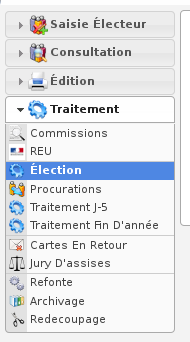

##################
Module "Élections"
##################

Le module "Élections" est accessible via le menu
(:menuselection:`Traitement --> Élection`).

.. contents::

Les scrutins
############

Les scrutins sont disponibles dans le menu traitement - Election.
Pour récupérer les scrutins en cours, il faut synchroniser les scrutins en cliquant sur le bouton "Synchroniser".

.. image:: a_module_election_scrutin_synchronisation.png

Après avoir synchronisé les scrutins, on peut accéder à ceux-ci dans le listing.

.. image:: a_module_election_scrutin_listing.png

Attention : pour synchroniser les scrutins il faut impérativement avoir fait la synchronisation des listes électorales et la refonte.

Les demandes de livrables auprès du Répertoire Électoral Unique
###############################################################

Les demandes de livrable sont disponibles dans la fiche de l'élection souhaitée.

******************
L'arrêt des listes
******************

L'arrêt des listes doit s'effectuer après avoir fait votre commission.
Attention : l'arrêt des listes ne se demande qu'une seule fois, contrairement aux listes d'émargement par exemple.
L'arrêt des listes permet d'éditer la liste d'émargement, la liste électorale, le tableau des cinq jours.

.. image:: a_module_election_scrutin_j20.png

L'action est disponible seulement entre J-23 et J-7 de la date de l'élection.
Si l'action n'est pas disponible nous avons un message dans le carré "Arrêt des listes" :

Si l'action est diponible nous avons ce message dans le carré "Arrêt des listes" : 

Pour demander un arrêt des listes il faut se rendre dans l'élection en cours et cliquer sur l'action "Demander l'arrêt des listes".

Le carré "Arrêt des listes" affiche un message indiquant que la demande de livrable a été envoyé au REU.

.. image:: a_module_election_scrutin_livrable_j20_attente.png

Attention : le fait de demander l'arrêt des listes sous-entend que le REU peut mettre un certain temps pour livrer les documents.

Lorsque la demande de livrable à été traitée par le REU, un message avec un picto vert s'affiche dans le carré "Arrêt des listes".

.. image:: a_module_election_scrutin_livrable_j20_valid.png

****************************
Le livrable "mouvements j-5"
****************************

Il est possible de récupérer le tableau des mouvements J-5 dans l'élection souhaitée.
L'action est disponible seulement entre J-6 et J-1 de la date de l'élection.
Si l'action n'est pas disponible nous avons un message dans le carré "Mouvements J-5" :

.. image:: a_module_election_scrutin_bloc_pas_propice_j5.png

Si l'action est diponible nous avons ce message dans le carré "Mouvements J-5" : 

.. image:: a_module_election_scrutin_bloc_propice_j5.png

Pour demander un tableau des mouvements J-5 il faut se rendre dans l'élection en cours et cliquer sur l'action "Demander le livrable 'mouvements J-5'".

Le carré "Mouvements J-5" affiche un message indiquant que la demande de livrable a été envoyé au REU.

.. image:: a_module_election_scrutin_livrable_j5_attente.png

Attention : le fait de demander le livrable "Mouvements J-5" sous entend que le REU peut mettre un certain temps pour livrer les documents.

Lorsque la demande de livrable à été traité par le REU, un message avec un picto vert s'affiche dans le carré "Mouvement J-5" nous indiquant que les documents sont disponible.

Il faut simplement cliquer sur le bouton "Télecharger" pour récupérer le tableau des mouvements J-5.

********************************
Le livrable "liste d'émargement"
********************************

Il est possible de récupérer la liste d'émargement dans l'élection souhaitée. 
Pour demander une liste d'émargement, il faut cliquer sur l'action "Demander le livrable 'liste d'émargement'".

Lorsque la demande de livrable à été traitée par le REU, un message avec un picto vert s'affiche dans le carré "Liste d'émargement" nous indiquant que les documents sont diponible.

Les éditions
############

Après avoir fait l'arrêt des liste l'accès aux éditions des listes électorale sont disponibles. Il faut simplement cliquer sur le bouton "Générer" de la liste souhaitée pour récupérer le document.

.. image:: a_module_election_scrutin_livrable_j20_edition.png

.. warning::

   Attention : l'édition des listes électorales lors de l'arrêt des listes se base uniquement sur le livrable J-20 transmis par le REU.

Lorsque la demande de liste d'émargement a été faite et a été traitée par le REU, les éditions sont disponibles en dessous du carré "Liste d'émargement"
Il y a trois éditions disponibles :

Le récapitulatif des mentions présents pour cette élection : 

.. image:: a_module_election_scrutin_livrable_edition_recap_mention.png

La liste électorale éditiée par liste et par bureaux de vote :

La liste d'émargement éditiée par liste et par bureau :

Il faut simplement cliquer sur le bouton "Télécharger" du document souhaité pour récupérer celui-ci.

.. warning::

   Attention : les éditions disponibles dans la partie Liste d'émargement se basent uniquement sur le livrable émargement transmis par le REU.