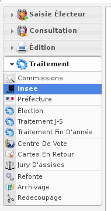
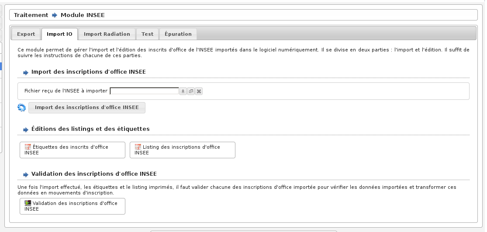

############
Module INSEE
############

Le module INSEE est accessible via le menu
(:menuselection:`Traitement --> Insee`).

.. contents::

Ce module permet de gérer les échanges dématérialisés de données électorales
entre les communes et l'INSEE.

.. note::

   Pour adhérer aux échanges dématérialisés avec l'INSEE, la commune doit
   faire part à sa direction régionale INSEE de rattachement son intention de
   dématérialiser ses envois. La commune reçoit à cet effet : un formulaire
   de demande d’adhésion, une convention qui est signée par les deux parties et
   un guide d’utilisation de l’application. En retour l'INSEE adresse à la
   commune par courriels séparés : un identifiant et un mot de passe.

Les communes transmettent à l'INSEE les informations sur les personnes
inscrites ou radiées de leurs listes électorales.

L'INSEE transmet aux communes :

* les demandes de radiations, notamment en cas d'inscription dans une autre
  commune,
* la liste nominative des personnes atteignant l'âge de 18 ans, susceptibles de
  bénéficier de l'inscription d'office sur les listes électorales,
* la liste des électeurs Français établis hors de France souhaitant voter hors
  de France pour les élections,
* des informations relatives à la perte des droits civiques.

L'INSEE prévient les communes lorsqu'un nouveau fichier est disponible et
les communes sont alors en charge d'aller le récupérer puis de l'importer dans
l'application openElec. De leur côté les communes, après chaque commission
administrative, récupèrent un fichier dans l'application openElec afin de le
transmettre à l'INSEE.

Inscriptions d'office INSEE
===========================

Ce sont des personnes atteignant l'âge de 18 ans, susceptibles de bénéficier de
l'inscription d'office sur les listes électorales.

Retirer le fichier auprès de l'INSEE
------------------------------------

L'INSEE permet de retirer ces fichiers via son application Aireppnet. L'INSEE
fournit des documentations concernant l'utilisation de cette application.

Vous trouverez les informations concernant le retrait de fichiers dans le
paragraphe 6 de la page 13 à la page 16 du fichier PDF suivant mis à disposition
par l'INSEE.
=> http://www.insee.fr/fr/publics/collectivites/GUIDEaireppnetV3-2.pdf

Une fois l'archive téléchargée sur votre poste de travail, vous trouverez des
instructions pour extraire de cette archive le fichier à importer dans
l'application openElec dans le fichier PDF suivant mis à disposition par l'INSEE.
=> http://www.insee.fr/fr/publics/collectivites/dezipper.pdf

L'INSEE peut également transmettre ces fichiers via un CD-ROM.

Importer le fichier provenant de l'INSEE
----------------------------------------

Un fichier au format TXT ou XML est nécessaire pour réaliser cette opération.

Cette fonction est accessible via le menu
(:menuselection:`Traitement --> Insee`) dans l'onglet
(:menuselection:`Import IO`).

    Ecran du module : INSEE - Import IO

A l'aide du champ " Fichier reçu de l'INSEE à importer " sélectionnez
un fichier à importer. Validez en cliquant sur " Import des inscriptions
d'office INSEE ".

Valider les propositions d'inscriptions d'office
------------------------------------------------

Cette fonction est accessible via le menu
(:menuselection:`Consultation --> Inscription Office INSEE`).

Il faut à présent valider chaque inscrit manuellement pour créer les mouvements
d'inscription correspondant.

Pour cela, cliquez sur le bouton précédant chaque nom, vous accéderez alors
à la fiche d'inscription de l'électeur correspondant. Le champ " observation "
contient l'adresse de l'électeur qu'il vous faudra copier dans le groupe
de champs " Adresse " de la fiche. Enfin indiquez le type de mouvement.

Une fois ces informations saisies, vous n'avez plus qu'à valider
ce mouvement en cliquant sur le bouton " Ajouter ".

Épurer les anciennes propositions d'inscriptions office INSEE
-------------------------------------------------------------

Vérifier que les anciennes propositions d'inscriptions office ont toutes été
vérifiées avant de toutes les supprimer. Aucun retour en arrière n'est possible
sur cette fonction.

Cette fonction est accessible via le menu
(:menuselection:`Traitement --> Insee`) dans l'onglet
(:menuselection:`Épuration`).

Radiations INSEE
================

Ce sont des **demandes de radiations** faites par l'INSEE qui interviennent
notamment en cas d'inscription dans une autre commune.

L'import de ces demandes de radiations INSEE dans l'application openElec est à
appréhender comme une aide à la saisie : il permet de charger l'intégralité du
fichier des demandes de radiations venant de l'INSEE dans un listing.

Ensuite la validation des demandes de radiations de ce listing une à une permet
de créer le mouvement de radiation sur l'électeur en question sans avoir à le
rechercher, en sélectionnant le motif de radiation de manière automatique et en
vérifiant qu'un mouvement de radiation n'existe pas déjà sur cet électeur. Cette
recherche se fait sur les critères : nom patronymique et date de naissance.
Lorsque la demande de radiation INSEE donne lieu à la création d'un mouvement
de radiation, elle est notée comme "traitée" (grisée dans le listing pour ne
plus être revalidée). Lorsqu'elle ne donne pas lieu à la création d'un
mouvement de radiation car le mouvement existe déjà ou qu'aucun électeur n'est
trouvé, alors cette demande de radiation reste dans l'état "non traitée"
jusqu'à la réception d'un prochain fichier d'import de l'INSEE qui sera précédé
d'une épuration des anciennes demandes de radiations.

Retirer le fichier auprès de l'INSEE
------------------------------------

L'INSEE permet de retirer ces fichiers via son application Aireppnet. L'INSEE
fournit des documentations concernant l'utilisation de cette application.

Vous trouverez les informations concernant le retrait de fichiers dans le
paragraphe 6 de la page 13 à la page 16 du fichier PDF suivant mis à disposition
par l'INSEE.
=> http://www.insee.fr/fr/publics/collectivites/GUIDEaireppnetV3-2.pdf

Une fois l'archive téléchargée sur votre poste de travail, vous trouverez des
instructions pour extraire de cette archive le fichier à importer dans
l'application openElec dans le fichier PDF suivant mis à disposition par l'INSEE.
=> http://www.insee.fr/fr/publics/collectivites/dezipper.pdf

L'INSEE peut également transmettre ces fichiers via un CD-ROM.

Importer le fichier provenant de l'INSEE
----------------------------------------

Cette fonction est accessible via le menu
(:menuselection:`Traitement --> Insee`) dans l'onglet
(:menuselection:`Import Radiation`).

Pour réaliser l'import du fichier provenant de l'INSEE, dans la section
*Import des radiations INSEE*, il faut :

* télécharger le fichier TXT ou XML provenant de l'INSEE dans le champ
  `Fichier reçu de l'INSEE à importer`
* valider le formulaire en cliquant sur le bouton `Import des radiations INSEE`

Lors de la validation du formulaire, plusieurs cas sont possibles :

* soit l'import s'est déroulé correctement comme le montre l'écran suivant :

  .. image:: module_insee_import_radiation_message_valid.png

  Il est alors possible d'aller valider les demandes de radiations de
  l'INSEE une à une pour les transformer en radiation si l'électeur fait
  bien partie de la liste électorale.

* soit le fichier de l'INSEE contient des erreurs comme le montre l'écran suivant :

  .. image:: module_insee_import_radiation_message_error_date.png

  Le fichier de l'INSEE contient au moins une erreur dans le format de date de
  naissance de l'électeur à la ligne indiquée du fichier TXT. Il est nécessaire
  de corriger cette date de naissance (en effet les critères qui permettent à
  openElec de rattacher la demande de radiation de l'INSEE à un électeur sont
  le nom et la date de naissance, si la date de naissance n'est pas correcte
  l'électeur ne pourra pas être radié).

  Pour le faire, il est possible :

  * soit de modifier la date en question à la ligne indiquée directement dans
    le fichier TXT dans un éditeur de texte (par exemple pour la date non
    valide du '00/08/1955' le fichier contient '00081955' : si l'électeur est
    connu on la remplace par '12081955' et si l'électeur n'est pas connu on la
    remplace par '01081955' uniquement dans le but de réussir l'import),
  * soit de contacter l'INSEE pour obtenir leur aide pour la correction de
    ce fichier.

  Une fois le fichier corrigé, il faut recommencer l'opération d'import.
  Plusieurs dates erronées peuvent se trouver dans ce fichier, si c'est le cas
  il faut répéter l'opération plusieurs fois.

Valider les demandes de radiations
----------------------------------

Cette fonction est accessible via le menu
(:menuselection:`Consultation --> Radiation INSEE`).

.. image:: module_insee_validation_radiation_listing.png

Cet écran présente le listing de toutes les demandes de radiations. Les
informations présentes dans ce listing sont celles issues directement du
fichier importé.

Les demandes de radiations sont soit grisées sans actions disponibles,
soit non grisées avec des actions disponibles.

Pour valider une demande de radiation il suffit de cliquer sur l'action de
validation présente en début de ligne. C'est ici que les critères de correspondance
entrent en jeu. Plusieurs cas sont possibles :

* Cas n°1 : un seul électeur correspond à l'association nom + date de naissance
  transmise par l'INSEE comme le montre l'écran suivant :

  .. image:: module_insee_validation_radiation_form_radiation.png

  Ce formulaire permet de sélectionner le type de mouvement de radiation (motif
  de radiation) du mouvement qui va être créé (un paramétrage correct des types
  de mouvements permet de sélectionner de manière automatique ce type de
  mouvement en fonction des données transmises par l'INSEE). Un clic
  sur le bouton `Ajouter l'enregistrement de la table : "Mouvement"` permet
  de créer effectivement le mouvement de radiation sur cet électeur.

  .. image:: module_insee_validation_radiation_form_radiation_message_valid.png

  Le bouton retour ramène au listing des demandes de radiations à valider. La
  demande qui vient d'être validée est désormais grisée.

* Cas n°2 : plusieurs électeurs correspondent comme le montre l'écran suivant :

  .. image:: module_insee_validation_radiation_doublon.png

  En cliquant sur l'action de validation présente en début de ligne de
  l'électeur qui correspond à la demande de radiation, c'est le processus du
  cas n°1 qui se poursuit.

* Cas n°3 : l'électeur qui correspond à l'association nom + date de naissance
  transmise par l'INSEE possède déjà un mouvement de radiation en cours comme
  le montre l'écran suivant :

  .. image:: module_insee_validation_radiation_mouvement_en_cours.png

  Le bouton retour ramène au listing des demandes de radiations à valider. La
  demande de radiation qui vient d'être validée reste dans l'état "non traitée".
  Il est possible, au choix de l'utilisateur, de la supprimer ou de la conserver
  (elle sera supprimée lors de la prochaine épuration).

* Cas n°4 : aucun électeur ne correspond à l'association nom + date de
  naissance transmise par l'INSEE comme le montre l'écran suivant :

  .. image:: module_insee_validation_radiation_aucune_correspondance.png

  Le bouton retour ramène au listing des demandes de radiations à valider. La
  demande de radiation qui vient d'être validée reste dans l'état "non traitée".
  Il est possible, au choix de l'utilisateur, de la supprimer ou de la conserver
  (elle sera supprimée lors de la prochaine épuration).

Épurer les anciennes demandes de radiations INSEE
-------------------------------------------------

Cette fonction est accessible via le menu
(:menuselection:`Traitement --> Insee`) dans l'onglet
(:menuselection:`Épuration`).

.. note:: Vérifier que les anciennes demandes de radiations ont toutes été
          validées/vérifiées avant de toutes les supprimer. Aucun retour en
          arrière n'est possible après épuration.

Export INSEE
============

L'export INSEE vous permet de créer deux fichiers à transférer à l'INSEE :

* l'un porte sur tous les mouvements concernant la date de tableau en cours et
  paramètres pour un export dans le paramétrage des mouvements
* l'autre sur l'export de mise en concordance des listes éléctorales et du fichier
  général des électeurs

Pour ce faire, allez dans la rubrique " Traitement / Insee ".

Si vous avez déjà effectué votre traitement de fin d'année et changé la date
de tableau, il vous faudra modifier la date de tableau. (Exemple, vous venez
d'effectuer le traitement au 10/01/2018 et vous avez mis votre date de
tableau au 28/02/2018 : vous devez tout d'abord changer votre date de
tableau au 10/01/2018)

    Ecran du module : INSEE - Export

Séléctionner le type de fichier d'export convenu avec l'INSEE (TXT ou XML).
Cliquez sur le bouton " Génération du fichier Export INSEE ".

.. note:: Pour réaliser un export xml le paramétrage des partenaires doit être
          effectué : un partenaire d'origine et un autre de destination doivent
          être créés.

Vous pouvez ensuite imprimer les statistiques des envois CNEN par bureau, le
listing du prochain envoi ainsi que le listing des mouvement déjà envoyés.

Si vous souhaitez envoyer un fichier déjà envoyé précédemment, cliquez sur
" listing des mouvements déjà envoyés à la date du tableau en cours ".
Vous trouverez dans la dernière colonne " envoi " la date d'envoi et son
numéro. Entrer ce numéro dans le champ " Numéro du transfert INSEE à renvoyer "
puis cliquez sur le bouton " Génération du fichier Export INSEE ".

De la même façon pour générer le fichier de mise en concordance il suffit de
cliquer sur le bouton " Génération du fichier MEC INSEE ".

Paramétrage des exports INSEE
-----------------------------

Il est nécessaire de paramétrer correctement la collectivité afin de générer des
exports TXT valides.

Le paramétrage des partenaires est optionel si les exports XML ne sont pas utilisés.
Dans le cas contraire, 2 types de partenaire doivent être paramétrés :

* partenaire d'origine (collectivité émettrice de l'export)
* partenaire de destination (INSEE)

Ecran du module : INSEE - Test
