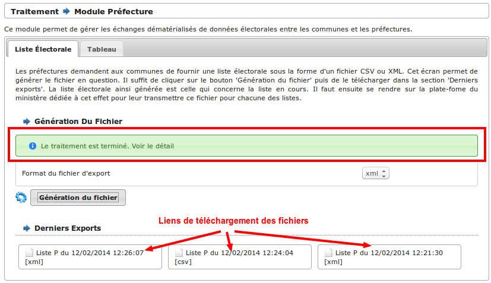

#################
Module Préfecture
#################

Ce module permet de gérer les échanges dématérialisés de données électorales
entre les communes et les préfectures.

.. note::

   La commune reçoit un identifiant et un mot de passe par sa préfecture pour 
   accéder à la plate-forme du ministère de l'intérieur 
   https://elistelec.interieur.gouv.fr.

Les communes transmettent à la préfecture via la plate-forme un export de leurs
listes électorales et les tableaux rectificatifs des différents tableaux.

Le module Préfecture est accessible via le menu 
(:menuselection:`Traitement --> Préfecture`).

.. image:: menu_traitement_prefecture.png

.. contents::

Dématérialisation des listes électorales
========================================

Cette fonction est accessible via le menu 
(:menuselection:`Traitement --> Préfecture`) dans l'onglet 
(:menuselection:`Liste Électorale`).

Générer le fichier à transmettre
--------------------------------

Les préfectures demandent aux communes de fournir une liste électorale sous la 
forme d'un fichier CSV ou XML. Cet écran permet de générer le fichier en 
question. 

Il suffit de cliquer sur le bouton 'Génération du fichier' puis de le
télécharger dans la section 'Derniers exports'. La liste électorale ainsi 
générée est celle qui concerne la liste en cours.

La section 'Derniers Exports' présente les dix derniers fichiers qui ont été 
générés. Le dernier apparaît en premier dans la liste. Si aucun fichier n'a 
encore été généré alors aucun élément n'apparaît. Le lien vers le fichier 
"Liste P du 12/02/2014 12:26:07 [xml]" comporte :

* Le type de liste : "Liste P" correspond à la liste principale, "Liste CE"
  correspond à la liste complémentaire européenne, "Liste CM" correspond à 
  la liste complémentaire municipales.
* La date de l'export : La date et l'hheure à laquelle le fichier a été généré.
* Le format de l'export : "[CSV]"  ou "[XML]" en fonction du choix effectué.

.. note::

   Cliquer avec le bouton droit de la souris sur le lien de téléchargement
   puis sélectionner "Enregistrer la cible du lien sous" permet de télécharger
   le fichier à l'emplacement de son choix.

Transmettre le fichier à la Préfecture
--------------------------------------

Il faut ensuite se rendre sur la plate-fome du ministère dédiée à cet effet 
(https://elistelec.interieur.gouv.fr) pour leur transmettre ces fichiers pour 
chacune des listes. Des documentations sont disponibles directement sur la
plate-forme pour son utilisation.

Dématérialisation des tableaux
==============================

Les préfectures demandent aux communes de fournir des tableaux sous la forme de
fichiers PDF. Tous les tableaux demandés sont directement téléchargeables 
depuis l'écran (:menuselection:`Edition --> Révision électorale`). 

Il faut ensuite se rendre sur la plate-fome du ministère dédiée à cet effet 
(https://elistelec.interieur.gouv.fr) pour leur transmettre ces fichiers pour 
chacune des listes. Des documentations sont disponibles directement sur la
plate-forme pour son utilisation.

