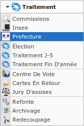

#################
Module Préfecture
#################

Ce module permet de gérer les échanges dématérialisés de données électorales
entre les communes et les préfectures.

.. note::

   La commune reçoit un identifiant et un mot de passe par sa préfecture pour 
   accéder à la plate-forme du ministère de l'intérieur 
   https://elistelec.interieur.gouv.fr.

Les communes transmettent à la préfecture via la plate-forme un export de leurs
listes électorales et les tableaux rectificatifs des différents tableaux.

Le module Préfecture est accessible via le menu 
(:menuselection:`Traitement --> Préfecture`).

.. contents::

