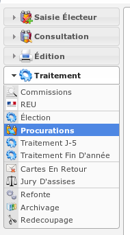
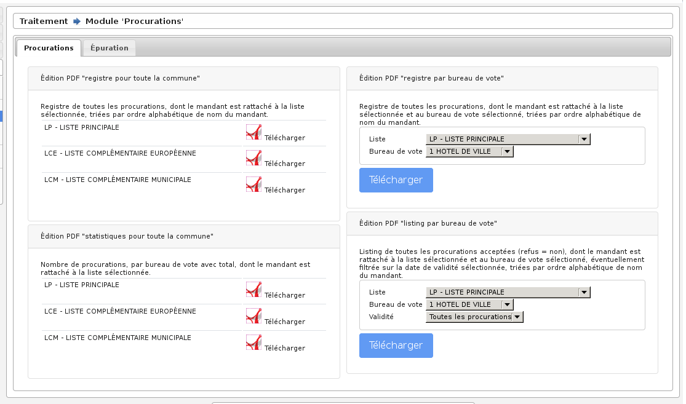
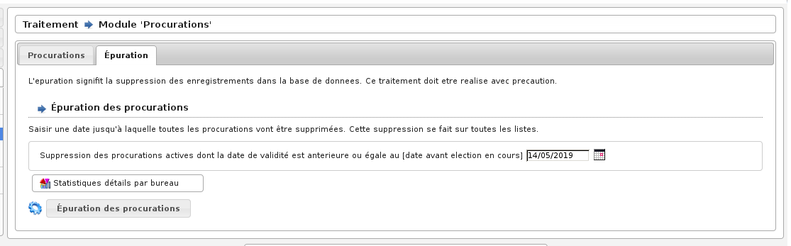

#####################
Module "Procurations"
#####################

Le module "Procurations" est accessible via le menu
(:menuselection:`Traitement --> Procurations`).

.. contents::

Éditions
========

Épuration des procurations
==========================

Pour supprimer les procurations, utilisez l'onglet " Epuration " du module "Procurations". Ce traitement doit être réalisé avec précaution car il n'y a aucun retour en arrière possible.

    Ecran du module : Procurations - Épuration

