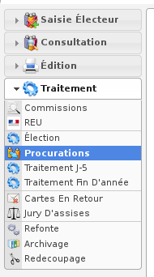

.. _module_procuration:

#####################
Module "Procurations"
#####################

Le module "Procurations" est accessible via le menu
(:menuselection:`Traitement --> Procurations`).

.. contents::

Préambule
=========

Les fonctionnalités du module "Procurations" :

* Saisie d'une procuration
* Refus d'une procuration
* Édition PDF "Registre des procurations" sur toute la commune
* Édition PDF "Registre des procurations" par bureau de vote
* Listing d'émargement des procurations valides le jour du scrutin
* Apposition des procurations en rouge sur la liste d'émargement
* Épuration de toutes les procurations

Gestion d'une procuration
=========================

:ref:`Saisie d'une procuration<procuration_saisie>`

Éditions
========

Épuration des procurations
==========================

Pour supprimer les procurations, utilisez l'onglet " Epuration " du module "Procurations". Ce traitement doit être réalisé avec précaution car il n'y a aucun retour en arrière possible.

.. figure:: a_module_procuration_epuration.png

    Ecran du module : Procurations - Épuration

