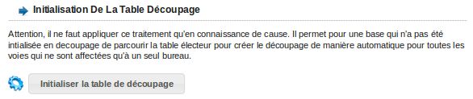

##################
Module Redécoupage
##################

Ce module est à manipuler avec précaution.
Lors d'une création d'un nouveau bureau de vote, ou lors d'une modification de découpage de voie, ce module permet d'effectuer automatiquement les mouvements de modifications sur les électeurs impliqués.
L'ensemble des mouvements de modification seront appliqués lors du prochain traitement annuel.
Pour appliquer le redécoupage, cliquer sur le bouton "Redécoupage Electoral", une fenêtre s'ouvre demandant la confirmation "êtes-vous sûr de vouloir confirmer cette action" cliquez sur OK si vous êtes sûr, sinon sur Annuler.

.. figure:: module_redecoupage.png

    Ecran du module : Redécoupage

Simulation
##########

Cet onglet permet d'éditer et de visualiser l'état actuel du découpage.

.. figure:: module_redecoupage.png

    Ecran du module : Redécoupage
    

Redécoupage
###########

Cet onglet permet d'éditer et de visualiser l'état actuel du découpage.

.. figure:: module_redecoupage.png

    Ecran du module : Redécoupage

Initialisation
##########

Cet onglet va vous permettre de préparer votre table voies et électeurs avant d'entamer un redécoupage. 
En effet, ce module permet de normaliser les voies (en cas de voies saisies en double, mal orthographiées etc.), effectuer un premier
découpage automatique (une voie se trouvant sur un seul bureau), initialiser les bureaux forcés.
Ces étapes sont nécessaires avant un redécoupage.

.. figure:: module_traitement_redecoupage_initialisation.png

    Ecran du module : onglet initialisation

*************************
Découpage électoral
*************************

Cette édition va vous permettre d'éditer un pdf de l'ensemble des voies de la commune ainsi que le bureau ou les bureaux affectés à cette voie
et le nombre d'électeur par voie.

    Ecran du module : Edition des voies par bureau
    
******************
Aide à la saisie
******************

Cette édition va vous permettre d'éditer un pdf de l'ensemble des voies de la commune qui n'ont pas de découpage.

    Ecran du module : Edition des voies non découpées
    
*****************************
Normalisation des voies
*****************************

Cet outil va vous permettre de normaliser les voies qui sont en double. La normalisation des voies s'effectue uniquement deux voies par deux voies.

    Ecran du module : Outil de normalisation des voies

Pour ce faire, cliquer sur le "+" devant le titre "voies pouvant être fusionnées", puis cliquer sur deux voies à fusionner, puis saisissez le nom exact de la voie, 
enfin, cliquer sur le bouton "fusionner les voies"

.. figure:: module_traitement_redecoupage_saisie_normalisation_voies.png

    Ecran du module : fusionner les voies
   
    
***************************************************
Initialisation des électeurs en bureau forcé
***************************************************

Cet outil va vous permettre de retirer l'affection forcée d'un bureau sur tous les électeurs qui sont normalement affecté au bureau défini dans le découpage
Aucun mouvement de modification ne sera effectué puisque l'électeur ne change pas de bureau.
Pour ce faire, cliquer sur le bouton "initiliser les électeurs en bureau forcé"

    Ecran du module : initialiser les électeurs en bureau forcé
    
    
******************************************
Initialisation de la table découpage
******************************************

Cet outil permet d'effectuer le découpage automatique de l'ensemble des voies qui n'auraient pas été découpées préalablement.
Pour chaque voie, si les électeurs sont affectés à un seul bureau, openElec effectue le découpage automatiquement. 
Après avoir initilisé la table découpage en cliquant sur le bouton "initiliser la table découpage", les voies qui restent à découper manuellement sont éditées dans le pdf "aide à la saisie"

(changer la figure)

    Ecran du module : initialisation du découpage    
