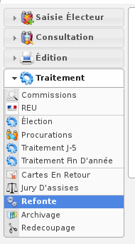
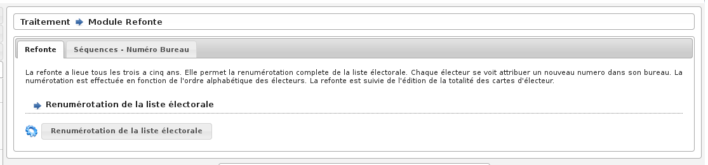

##############
Module Refonte
##############

Le module Refonte est accessible via le menu
(:menuselection:`Traitement --> Refonte`).

.. contents::

Préambule
=========

La refonte a lieu tous les trois à cinq ans. Elle permet la renumérotation
complète de la liste électorale. Chaque électeur se voit attribuer un nouveau
numéro dans la liste ainsi qu'un nouveau numéro dans son bureau. La
numérotation est effectuée en fonction de l'ordre alphabétique des électeurs.
La refonte est suivie de l'édition de la totalité des cartes d'électeur.

Appliquer la refonte
====================

Pour appliquer la refonte, il suffit de démarrer le traitement en cliquant
sur le bouton " Renumérotation de la liste électorale " et d'attendre que le
message de confirmation s'affiche.

    Ecran du module : Refonte

Imprimer les cartes électorales
===============================

La refonte est suivie de l'impression des cartes électorales via le :ref:`module_carte_electorale`.

