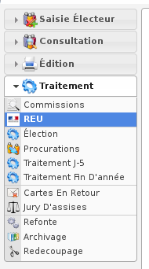

.. _module_reu:

##########
Module REU
##########

Le module REU est accessible via le menu
(:menuselection:`Traitement --> REU`).

.. contents::

Préambule
=========

Ce module permet de gérer les échanges dématérialisés de données électorales
entre les communes et le Répertoire Électoral Unique.

.. note::

   La commune reçoit un identifiant et un mot de passe par sa préfecture pour
   accéder à la plate-forme du ministère de l'intérieur
   https://www.insee.fr/fr/information/3539086

openElec se connecte directement à la plate-forme du minisitère de l'intérieur,
la commune a simplement besoin de s'y connecter pour gérer les comptes
utilisateurs (dont celui d'openElec). Pour le reste, les communes ne doivent
absolument jamais se connecter à cette plate-forme pour modifier des informations
sur les électeurs ou saisir des mouvements.

.. _module_reu_statut:

Statut
======

.. image:: a_module_reu_onglet_main.png

Cet écran permet de configurer la connexion logicielle au REU et de visualiser
son statut.

.. _module_reu_synchronisation_liste_electorale:

Synchronisation Liste Électorale
================================

Cet écran permet de mettre en concordance la liste des électeurs openElec avec
celle du REU. L'objectif de cette étape est d'associer un numéro INE à chaque
électeur openElec.

