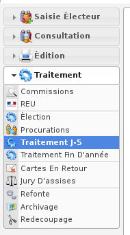
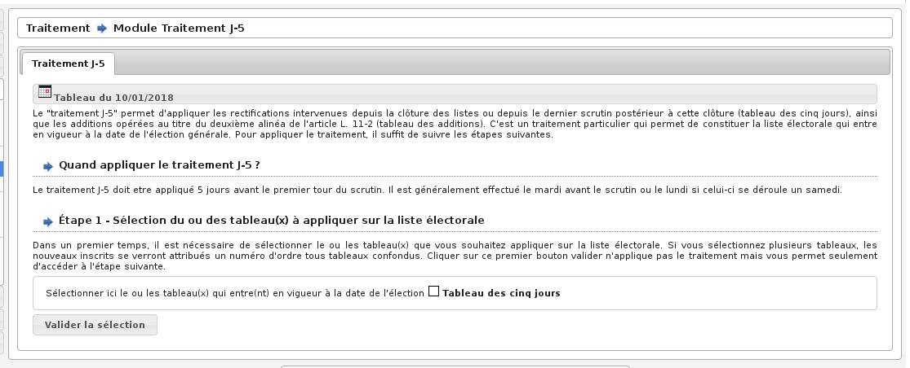

#####################
Module Traitement J-5
#####################

Le module Traitement J-5 est accessible via le menu
(:menuselection:`Traitement --> Traitement J-5`).

.. contents::

Pour le traitement J-5, seuls les mouvements à effet immédiat sont pris en
compte. Ce traitement a lieu 5 jours avant l’élection. La procédure pour
effectuer ce traitement est la même que celle du traitement de fin d’année
excepté qu’il faut choisir dans le menu " Traitement J-5 ".

:ref:`cf. Module : Traitement Annuel.<traitements_module_traitement_annuel>`

    Ecran du module : Traitement J-5
