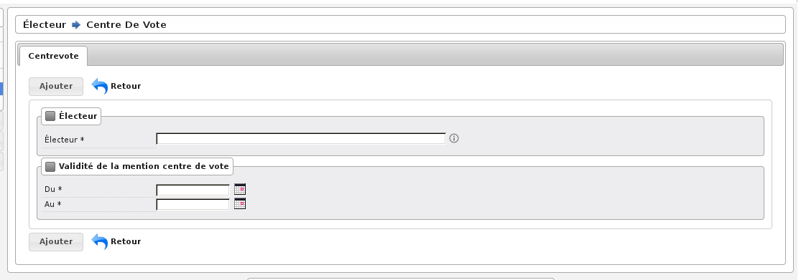

######################
Mention Centre de vote
######################

Préambule
=========

Les mentions inscrites en centre de vote sont inscrites sur la liste
d’émargement par le traitement des procurations. La zone procuration
de la table électeur est mise à jour par le traitement.

Saisie des informations
=======================

Vous devez saisir l’électeur:

    * soit en tapant l’ID électeur, soit en tapant une partie ou l’intégralité du nom, ou une partie de son nom et une partie de son prénom.

Date de début et de fin de validité

    * Possibilité de saisir à l’aide du calendrier.
    * Possibilité de saisir : 2506018 => 25/06/2018.
    * Possibilité de saisir : 25062018 => 25/06/2018.

    Rubrique Saisie : Centre de Vote

Validation des informations
===========================

Une fois toutes les informations saisies, vous pouvez valider le
formulaire pour enregistrer la mention.

Validation : Un électeur est dans un centre de vote pour une même période.
