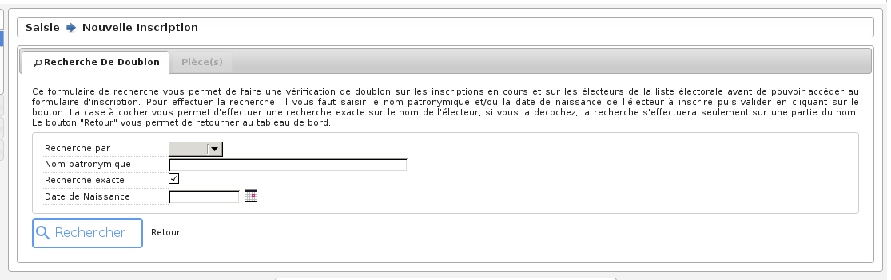
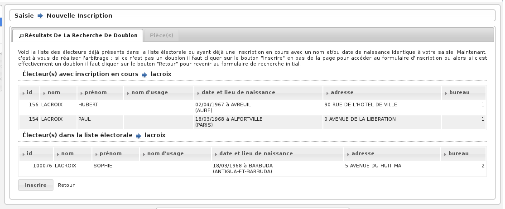
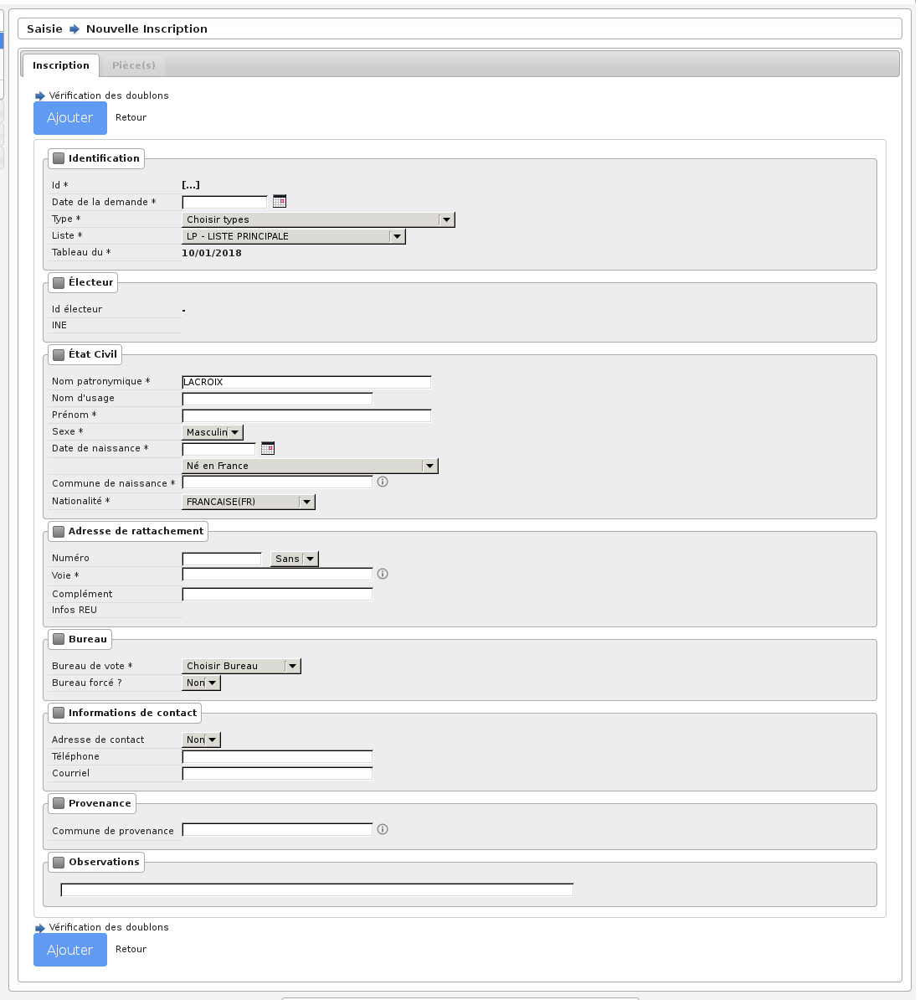

###########
Inscription
###########

Préambule
=========

Avant de procéder à une inscription, il faut vérifier que certains paramètres
sont correctement réglés :

* La date de tableau : il faut que cette date soit réglée à la date du prochain tableau, c'est-à-dire au prochain traitement du calendrier électoral (le 10/01/2018 ou le 28/02/2018).

* La liste en cours : il faut que la liste électorale en cours soit celle sur laquelle vous voulez travailler (01 liste générale, 02 liste européenne, 03 liste européenne municipale).

Recherche de l'électeur
=======================

En premier lieu, il faut réaliser une recherche de l'électeur. Un formulaire
permet de saisir le nom et/ou la date de naissance de l'électeur à inscrire
pour vérifier qu'il n'est pas déjà présent dans la liste électorale ou dans
les nouveaux inscrits.

   Formulaire de recherche de doublon avant la saisie d'une inscription

* Dans le cas d'une correspondance avec un électeur déjà inscrit : il peut s'agir d'un homonyme.

    Vérification des doublons avant la saisie d'une inscription

* Dans le cas où il n'y a pas de correspondance : l'affichage bascule sur le formulaire d'inscription.

Saisie des informations
=======================

Le formulaire permet de saisir différentes informations sur le nouvel inscrit :

* **Mouvement & Bureau**

	* Type : *C'est le type d'inscription, il faut sélectionner celui qui convient pour que le mouvement possède les bons paramètres par exemple "inscription judiciaire", "venant d'une autre commune", ...*

	* Bureau : *C'est le bureau de vote auquel l'électeur va être rattaché, il est possible de ne pas le préciser si le module de découpage des voies est paramétré correctement. Ce champ est associé au champ "forcé".*

	* Forcé : *On peut forcer l'affectation d'un bureau pour un électeur, il faut sélectionner "Oui" ou "Non". Ce choix peut être dû au fait que le module de découpage des voies est paramétré ou non.*

* **Etat Civil**

	* Civilité : *Permet d'afficher devant le nom de l'électeur une mention "Mr", "Mme" ou "Mlle".*

	* Sexe : *Sexe de l'électeur ou de l'électrice.*

	* Nom : *C'est le nom de famille de naissance de la personne (le nom de jeune fille pour les femmes mariées).*

	* Usage : *C'est le nom d'épouse de l'électrice.*

	* Prénom : *Le ou les prénoms de l'électeur.*

	* Situation : *Permet de sélectionner la situation de l'électeur ou de l'électrice pour déterminer le mot de liaison sur les différentes éditions par exemple "veuve" ou "mariée".*

* **Naissance & Nationalité**

	* Date de naissance : *Il suffit de cliquer sur le calendrier pour sélectionner une date de naissance ou alors saisir cette date dans le champ dans un des formats suivants : "20121975" ou "20/12/1975".*

	* Département et lieu de naissance : *il est possible de saisir le département et la ville de naissance, ou bien la ville de naissance et le département s'affichera automatiquement*

	.. image:: a_saisie_inscription_france.png	

	* Electeur né en France : * Par défaut le selecteur est chargé avec la valeur "Né en France".*

	.. image:: a_saisie_inscription_etranger.png
	
	* Electeur né à l'étranger : * Si l'électeur est né à l'étranger on sélectionne "Né à l'étranger" dans le sélecteur et les champs  Pays de naissance et Libellé commune de naissance s'affichent.*

	.. image:: a_saisie_inscription_ancien_departement_francais.png

	* Electeur né dans un ancien département fraçais d'Algérie : * Si l'électeur est né dans un ancien département d'Algérie, on sélectionne "Né dans un ancien département d'Algérie" dans le selecteur. Les champs Département de naissance et Libellé commune de naissance s'affichent.*

	* Nationalité : *Nationalité de l'électeur.*

* **Adresse**

	* N° : *C'est le numéro de l'habitation de l'électeur, si il n'y a pas de numéro alors saisir la valeur "0".*

	* Complément : *C'est le complément du numéro d'habitation par exemple "bis", "ter", etc... Il faut faire son choix dans la liste de choix en dessous du champ n°, si il n'y a pas de complément sélectionner "Sans".*

	* Id/Libellé Voie : *C'est la rue ou habite l'électeur. Il y a deux modes de saisie, soit en saisissant le code de la voie (c'est le code interne au logiciel qui permet de répertorier les rues), soit en tapant le libellé de la voieIl faut absolument que la rue soit connue par le logiciel, c'est-à-dire qu'elle soit dans la table voie, c'est-à-dire que la rue soit déjà créée pour que l'inscription soit valide.*

	* Complément : *Cest le champ au dessous du libellé de la voie il permet de stocker des informations complémentaires sur l'adresse de l'électeur. Attention ces informations apparaîtront sur les cartes d'électeur et sur les étiquettes de propagande.*

Les informations suivantes sont facultatives, vous n'êtes pas obligé de les
saisir si ce n'est pas nécessaire :

* **Résident**

	* Résident : *"Oui" ou "Non", si l'électeur est domicilié dans la commune mais est résident.*

	* Adresse : *Numéro de l'habitation et libellé de la rue.*

	* Complément : *Complément d'adresse.*

	* Code postal : *Code Postal.*

	* Ville : *Commune.*

* **Provenance**

	* Commune provenance : *Il faut saisir le code insee de la commune de provenance ou son libellé, uniquement si l'inscription est de type "changement de commune".*

	* Observation : *C'est une information sur l'inscription de l'électeur.*

* **Mouvement**

Ces informations sont uniquement les caractéristiques du mouvement, elles
signalent qu'il est actif ou non, le numéro de la liste ainsi que la date du
tableau. Ce sont des informations importantes comme le dit le préambule de cet
article.

    Saisie d'une nouvelle inscription

Validation des informations
===========================

Une fois toutes les informations saisies, vous pouvez vérifier qu'il n'y a pas
de doublon avec l'électeur que vous êtes en train d'inscrire en cliquant sur
l'icone qui est avant le bouton "Ajouter Mouvement".

Si vous ne trouvez aucun résultat pertinent, vous pouvez valider le formulaire
pour enregistrer l'inscription. Une fois validé, le formulaire s'affiche à
nouveau avec des informations sur l'enregistrement tout en bas de la page.
Vérifiez bien que tout s'est déroulé correctement et cliquez sur le bouton
"Retour" (tout en bas du formulaire) pour consulter la liste des inscriptions
en cours.

Attention! Ce n'est pas parce que l'électeur est inscrit, qu'il est présent
sur la liste électorale, il faut d'abord que la commission valide l'inscription
pour que le traitement l'intègre dans la liste.
