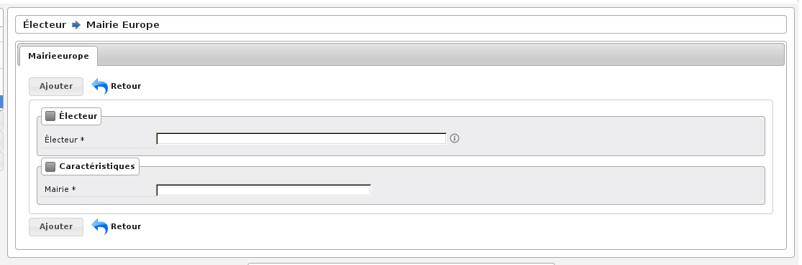

#####################
Mention Mairie Europe
#####################

Préambule
=========

Cet écran sert à gérer les électeurs votant pour les municipales dans une
mairie européenne. Les mentions "inscrit en mairie européenne" sont
inscrites sur la liste d’émargement par le traitement des procurations.
La zone procuration de la table électeur est mise à jour par le traitement.

Saisie des informations
=======================

L’électeur doit être saisi :

    * soit en tapant l’ID électeur, soit en tapant une partie ou l’intégralité du nom, soit en tapant une partie du nom et une partie du prénom.

Ensuite il faut faire la saisie de la mairie européenne.

    Rubrique Saisie : Mairie Europe

Validation des informations
===========================

Une fois toutes les informations saisies, vous pouvez valider le
formulaire pour enregistrer la mention.
