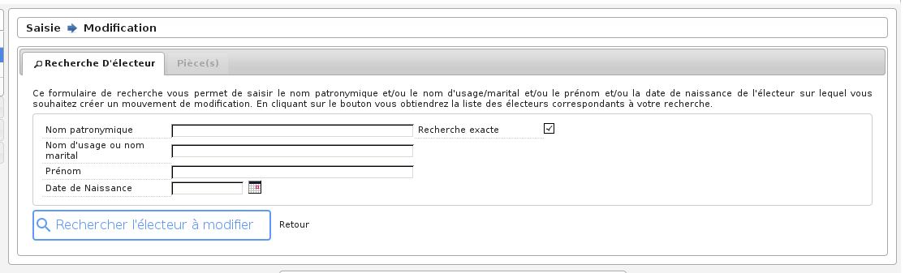

############
Modification
############

Préambule
=========

La modification est un mouvement qui regroupe une radiation et une inscription.
En effet un électeur qui change d'adresse, subit une radiation avec son
ancienne adresse et une inscription avec sa nouvelle. Cette modification
permet donc de faire ces deux mouvements en un seul. La procédure est la même
que pour la radiation, excepté que c'est l'icone qui représente un M que l'on
doit cliquer devant le nom de l'électeur à modifier.

Avant de procéder à une modification, il faut vérifier que certains paramètres
sont correctement réglés :

* La date de tableau : il faut que cette date soit réglée à la date du prochain tableau, c'est-à-dire au prochain traitement du calendrier électoral (le 10/01/2018 ou le 28/02/2018).

* La liste en cours : il faut que la liste électorale en cours soit celle sur laquelle vous voulez travailler (01 liste générale, 02 liste européenne, 03 liste européenne municipale).

Recherche de l'électeur
=======================

En premier lieu, il faut réaliser une recherche de l'électeur. Un formulaire
permet de saisir le nom patronymique et/ou le nom d'usage/marital et/ou le
prenom et/ou la date de naissance de l'electeur sur lequel vous souhaitez
créer un mouvement de modification. Une fois que le résultat de la recherche
s'affiche, vous pouvez voir une icône de modification devant le nom de
l'électeur. Il suffit de cliquer dessus pour obtenir le formulaire de
modification.

    Formulaire de recherche d'un électeur en vue d'une modification

    Résultat de recherche d'un électeur en vue d'une modification

Saisie des informations
=======================

Le formulaire permet de changer différentes informations sur l'électeur à
modifier :

* **Mouvement & Bureau**

	* Type : *C'est le type de modification, il faut sélectionner celui qui convient pour que le mouvement possède les bons paramètres par exemple "changement adresse", "modification état civil", ...*

	* Bureau : *C'est le bureau de vote auquel l'électeur va être rattaché, il est possible de ne pas le préciser si le module de découpage des voies est paramétré correctement. Ce champ est associé au champ "forcé".*

	* Forcé : *On peut forcer l'affectation d'un bureau pour un électeur, il faut sélectionner "Oui" ou "Non". Ce choix peut être dû au fait que le module de découpage des voies est paramétré ou non.*

* **Etat Civil**

	* Civilité : *Permet d'afficher devant le nom de l'électeur une mention "Mr", "Mme" ou "Mlle".*

	* Sexe : *Sexe de l'électeur ou de l'électrice.*

	* Nom : *C'est le nom de famille de naissance de la personne (le nom de jeune fille pour les femmes mariées).*

	* Usage : *C'est le nom d'épouse de l'électrice.*

	* Prénom : *Le ou les prénoms de l'électeur.*

	* Situation : *Permet de sélectionner la situation de l'électeur ou de l'électrice pour déterminer le mot de liaison sur les différentes éditions par exemple "veuve" ou "mariée".*

* **Naissance & Nationalité**

	* Date de naissance : *Il suffit de cliquer sur le calendrier pour sélectionner une date de naissance ou alors saisir cette date dans le champ dans un des formats suivants : "20121975" ou "20/12/1975".*
	
	* Electeur né en France : *Par défaut le sélecteur est chargé avec la valeur "Né en France". Le champ commune de naissance peut prendre un code de commune et/ou le nom d'une commune. Exemple : Arles 13, si la valeur existe elle s'affiche automatiquement et il suffit de cliquer dessus pour la valider*.

	.. image:: a_saisie_inscription_france.png	
	
	* Electeur né à l'étranger : *Si l'électeur est né à l'étranger on sélectionne "Né à l'étranger" dans le sélecteur et les champs "Pays de naissance" et "Libellé commune de naissance" s'affichent. Le champ "Pays de naissance" peut prendre un code pays et/ou un nom de Pays. Exemple : 99134 Royaume d'espagne si la valeur existe elle s'affiche automatiquement et il suffit de cliquer dessus pour la valider. La valeur du champ "Libellé commune de naissance" est de type text*

	.. image:: a_saisie_inscription_etranger.png

	* Electeur né dans un ancien département français d'Algérie :*Si l'électeur est né dans un ancien département français d'Algérie, on sélectionne "Né dans un ancien département français d'Algérie" dans le sélecteur. Les champs "Département de naissance" et "Libellé commune de naissance" s'affichent. La valeur du champ "Libellé commune de naissance" est de type text. Le champ "Département de naissance" peut prendre un code de département et/ou un nom de département.Exemple : 91352 Alger si la valeur existe elle s'affiche automatiquement et il suffit de cliquer dessus pour la valider. Les valeurs existantes pour ce champs sont* : 
		
		- 91352 - ALGER
		- 92352 - ORAN
		- 93352 - CONSTANTINE
		- 94352 - TERRITOIRES DU SUD

	.. image:: a_saisie_inscription_ancien_departement_francais.png

	* Nationalité : *Nationalité de l'électeur.*

* **Adresse**

	* N° : *C'est le numéro de l'habitation de l'électeur, si il n'y a pas de numéro alors saisir la valeur "0".*

	* Complément : *C'est le complément du numéro d'habitation par exemple "bis", "ter", etc... Il faut faire son choix dans la liste de choix en dessous du champ n°, si il n'y a pas de complément sélectionner "Sans".*

	* Id/Libellé Voie : *C'est la rue ou habite l'électeur. Il y a deux modes de saisie, soit en saisissant le code de la voie (c'est le code interne au logiciel qui permet de répertorier les rues), soit en tapant le libellé de la voieIl faut absolument que la rue soit connue par le logiciel, c'est-à-dire qu'elle soit dans la table voie, c'est-à-dire que la rue soit déjà créée pour que l'inscription soit valide.*

	* Complément : *Cest le champ au dessous du libellé de la voie il permet de stocker des informations complémentaires sur l'adresse de l'électeur. Attention ces informations apparaîtront sur les cartes d'électeur et sur les étiquettes de propagande.*

* **Résident**

	* Résident : *"Oui" ou "Non", si l'électeur est domicilié dans la commune mais est résident.*

	* Adresse : *Numéro de l'habitation et libellé de la rue.*

	* Complément : *Complément d'adresse.*

	* Code postal : *Code Postal.*

	* Ville : *Commune.*

Validation des informations
===========================

Une fois toutes les informations modifiées, vous pouvez valider le formulaire
pour enregistrer la modification. Une fois validé, le formulaire s'affiche
à nouveau avec des informations sur l'enregistrement tout en bas de la page.
Vérifiez bien que tout s'est déroulé correctement et cliquez sur le bouton
"Retour" (tout en bas du formulaire) pour consulter la liste des
modifications en cours.

