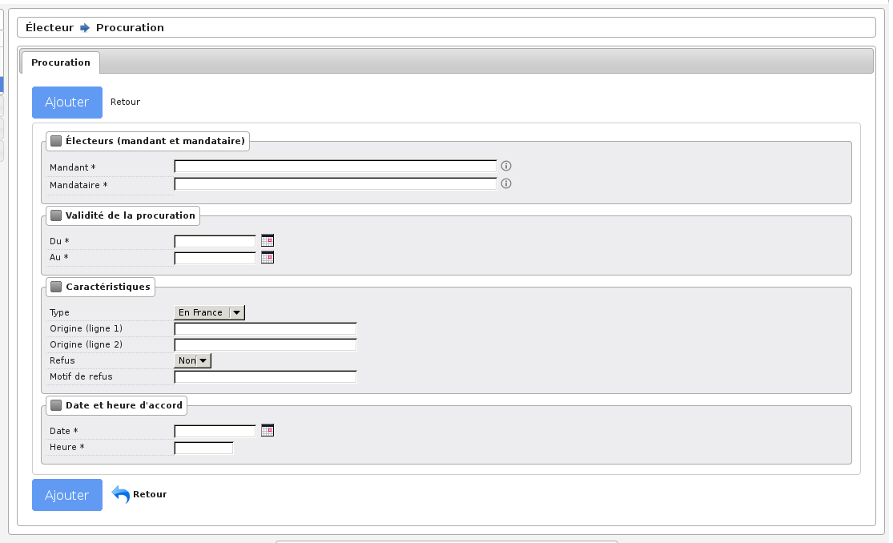

###########
Procuration
###########

Préambule
=========

Cet écran sert à gérer les procurations. Les procurations sont inscrites sur la liste d’émargement.

Saisie des informations
=======================

    Formulaire d'ajout d'une procuration

Le formulaire permet de saisir les informations suivantes sur la procuration :

* **Électeurs (mandant et mandataire)**

    * Mandant
    * Mandataire

* **Validité de la procuration**

    * Du / Au : *les dates de validité de la procuration au format JJ/MM/YYYY (par exemple : pour une procuration valide uniquement le 26/05/2019, il faut saisir du 26/05/2019 au 26/05/2019)*

* **Caractéristiques**

    * Type
    * Origine (ligne 1) : *le nom et la qualité de l'autorité qui a dressé l'acte de procuration (par exemple : la gendarmerie qui a enregistré la procuration)*
    * Origine (ligne 2) : *suite du nom et de la qualité de l'autorité qui a dressé l'acte de procuration (par exemple : le gendarme qui a enregistré la procuration)*
    * Refus : *une procuration peut être refusée (une procuration refusée apparaît dans le registre mais n'apparaît pas dans le listing des procurations)*
    * Motif de refus : *lorsque la procuration est refusée un motif de refus doit être saisi (il appraît sur le registre)*

* **Date et heure d'accord**

    * Date
    * Heure

Validation des informations
===========================

Une fois toutes les informations saisies, vous pouvez valider le
formulaire pour enregistrer la procuration.

Le refus d'une procuration entraine l'affichage sur le tableau d'un lien vers
l'édition d'un courrier de refus adressé

Message de Vérification : Un mandant ne donne qu’une procuration pour une
même période. Un mandataire a au plus 2 mandats pour une même période dont
au moins un hors France. Un électeur en centre de vote ne peut pas donner
procuration. Dans ces cas la procuration peut tout de même être enregistrée si
elle est refusée. Des outils permettent de vérifier les procurations et de les
éditer. Ils se trouvent dans l’écran du menu « Traitement Procurations &
Mentions ».
